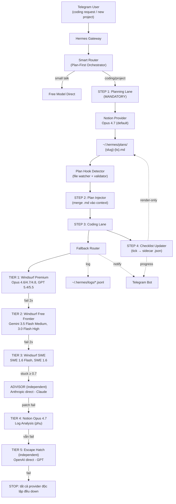
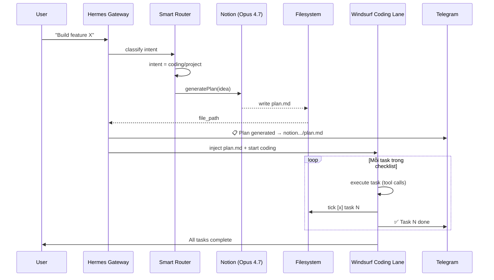
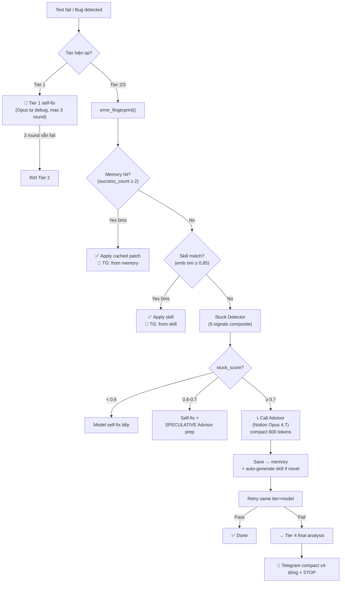
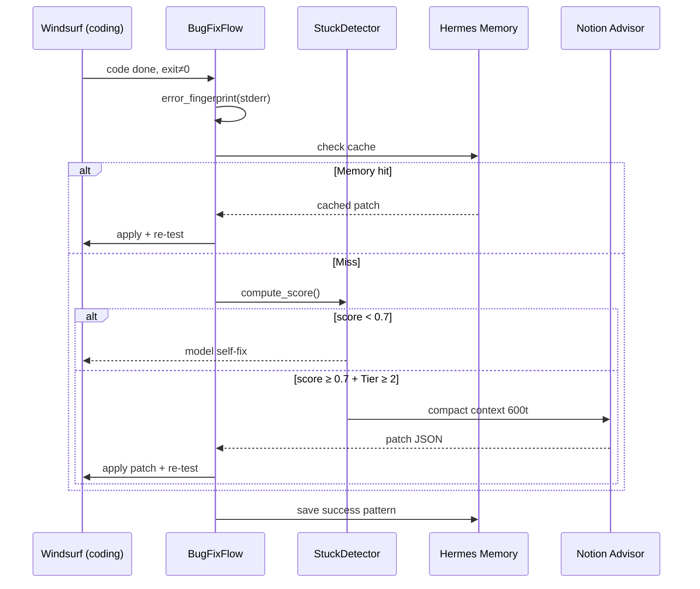
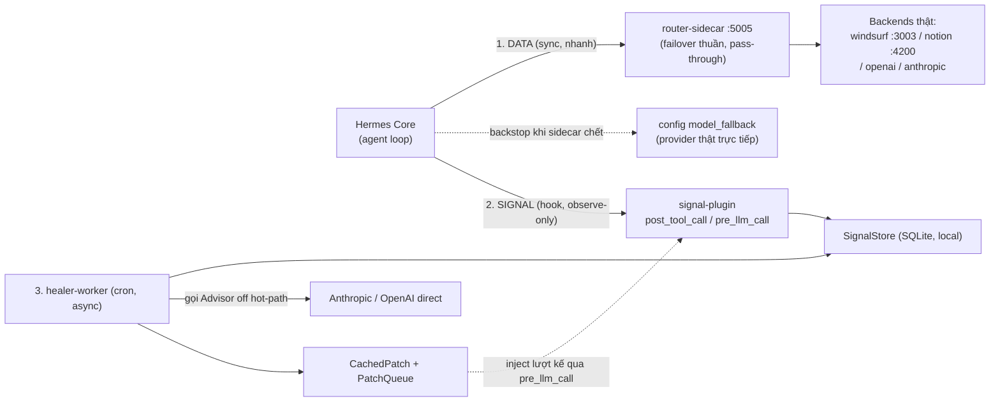
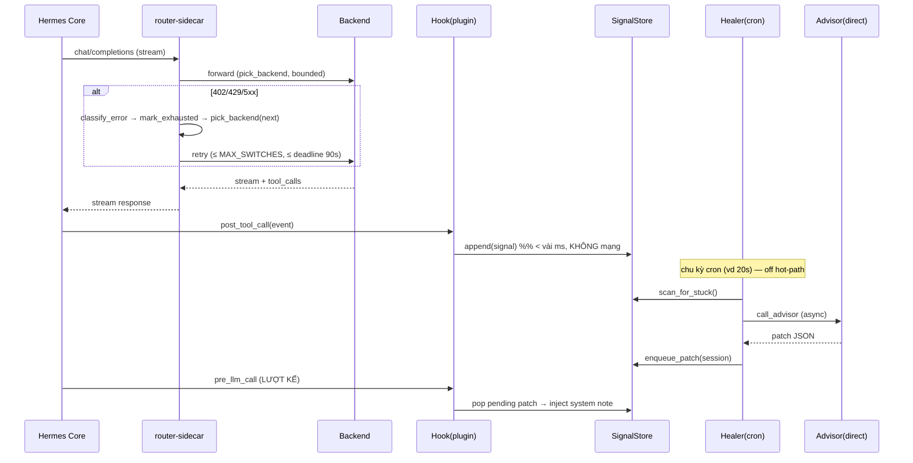

# Hermes Gateway — Windsurf Tiered Fallback Architecture (Plan 2026)

<aside>
🚀

**Mục tiêu (v1.2.2 — Self-Healing + Latency Optimized):**

1. **Tier-Gated Advisor:** Tier 1 (Opus 4.7/4.8, GPT 5.5) tự self-fix, KHÔNG gọi Notion Advisor. Chỉ Tier 2+ mới được gọi Notion.
2. **Stuck Detector 5-signals:** Phân biệt model đang tiến bộ (self-fix) vs đang loay hoay (cần Advisor). Composite score ≥ 0.7 mới trigger.
3. **Hermes-native integration:** Tận dụng `memory`, `skills`, `compact_context`, `session store`, `tool_registry` để giảm 60-88% tokens + skip Advisor khi pattern đã học.
4. **Latency Budget Optimizer:** Connection pool + speculative parallel + semantic cache + predictive pre-warm → overhead 1 switch từ 5-7s xuống còn 1.2-1.8s (-75%).
5. **BugFixFlow post-coding:** Sau khi Windsurf code xong → auto chạy test → nếu fail → Stuck Detector + Advisor loop (chỉ Tier 2+).
</aside>

<aside>
🎯

**Mục tiêu (v1.1):** Tối ưu kiến trúc `volambnb/windsurf-notion-llm-hermes` theo workflow **Plan-First Mandatory**:

1. Mọi request coding/tool/dự án mới → **BẮT BUỘC** qua Notion Provider (Opus 4.7) sinh plan `.md` trước.
2. Hermes Gateway hook và nhận diện file `.md` → inject vào context coding.
3. Coding Lane (Windsurf tiered fallback) thực thi theo plan, mỗi task tick checklist khi xong.
4. Log + Telegram realtime, Notion là escape hatch khi cả 3 tier Windsurf fail.
</aside>

## 📐 Kiến trúc tổng quan



---

## 🧠 Plan-First Workflow (NEW — v1.1)

<aside>
⚡

**Nguyên tắc cốt lõi:** Không có coding nào được phép chạy thẳng. Mọi request coding/tool/dự án mới đều phải có plan `.md` từ Notion trước khi vào Windsurf.

</aside>

### Tại sao Plan-First?

- **Tiết kiệm quota Windsurf:** Notion miễn phí làm phần "think" → Windsurf chỉ làm phần "do" (tool calling) → giảm 40-60% token Premium.
- **Context dày hơn:** Plan `.md` đóng vai trò system context cho Windsurf → giảm hallucination, tăng độ chính xác tool call.
- **Có thể audit:** Mọi dự án có file plan để review trước, rollback dễ.
- **Resume được:** Nếu coding lane fail giữa chừng, plan vẫn còn → resume từ task chưa tick.

### Flow 4 bước chi tiết



### Edge cases

| Case | Xử lý |
| --- | --- |
| User request quá nhỏ (vd "rename biến X") | Skip plan-first, vào thẳng Coding Lane (size threshold: < 50 tokens hoặc 1 tool call dự kiến) |
| Notion fail khi sinh plan | Fallback: dùng Windsurf Gemini 3.5 Flash Medium (Tier 2) sinh plan tạm |
| Plan `.md` không pass schema validation | Retry Notion 2 lần với prompt rõ hơn, vẫn fail → cảnh báo Telegram + cho user override |
| User muốn skip plan | Override bằng prefix `!nopl` trong message hoặc env `HERMES_PLAN_REQUIRED=false` |
| Plan đã tồn tại (resume) | Detector tìm file plan match slug, hỏi user "resume hay tạo mới?" |

---

## 🪜 Fallback Chain — Chi tiết từng Tier

### Tier 1 — Windsurf Premium (default)

- **Provider:** WindsurfAPI (port 3003)
- **Models** (theo thứ tự thử):
    1. `claude-opus-4.8-thinking`
    2. `claude-opus-4.7-thinking`
    3. `claude-opus-4.6-thinking`
    4. `gpt-5.5`
    5. `gpt-5.4`
- **Retry:** 2 lần / model, exponential backoff (1s → 3s)
- **Tool calling:** ✅ Full native
- **Use case:** Mọi coding task mặc định

### Tier 2 — Windsurf Free Frontier

- **Provider:** WindsurfAPI (port 3003)
- **Models:**
    1. `gemini-3.5-flash-medium`
    2. `gemini-3.0-flash-high`
- **Retry:** 2 lần / model
- **Tool calling:** ✅ Full native (Gemini function calling)
- **Use case:** Khi Tier 1 hết quota / 429 / trial limit

### Tier 3 — Windsurf SWE

- **Provider:** WindsurfAPI (port 3003)
- **Models:**
    1. `swe-1.6-flash`
    2. `swe-1.6`
- **Retry:** 2 lần / model
- **Tool calling:** ✅ Native, optimized cho code edit
- **Use case:** Last resort còn tool calling

### Advisor — Anthropic direct (v1.3, ĐỘC LẬP)

- **Provider:** Anthropic API trực tiếp (KHÔNG qua Notion)
- **Model:** Claude (Opus/Sonnet) — resolve động qua `/v1/models`
- **Tool calling:** ✅ (trả patch JSON `tool_calls`)
- **Trigger:** Tier 2/3 có `stuck_score ≥ 0.70` → phân tích lỗi UNKNOWN + đưa patch (max 2 lần/task)

### Tier 4 — Notion Provider (Log Analysis phụ)

- **Provider:** Notion2API (port 4200)
- **Model:** `opus-4.7` (via Notion AI)
- **Tool calling:** ❌ Không có
- **Mode:** `log_analysis` — đọc log JSONL → trả về markdown diagnosis
- **Use case:** Phân tích root cause. **KHÔNG còn là escape hatch cuối** — vai trò đó chuyển sang Tier 5 độc lập.

### Tier 5 — Escape Hatch cuối (v1.3, ĐỘC LẬP)

- **Provider:** OpenAI API trực tiếp (KHÁC cả Notion lẫn Anthropic)
- **Model:** GPT — resolve động qua `/v1/models`
- **Tool calling:** ✅
- **Use case:** Khi Advisor + Tier 4 đều fail → chạy 1 lần cuối rồi STOP. Đảm bảo không còn SPOF Notion (xem R2).

---

## 🧠 Smart Fallback v1.2.2 — Self-Healing + Latency Optimized (NEW)

<aside>
⚡

**Triết lý:** *Self-Healing Loop có Advisor + Tier Gate + Stuck Detector + Hermes Memory*. Không retry mù, không gọi Notion bừa, không lãng phí latency. Học từ lỗi qua memory/skills cache.

</aside>

### Decision flow tổng quan



### Phần A — Tier Gate + Stuck Detector

#### A1. Tier Gate

- **Tier 1** (Opus 4.7/4.8, GPT 5.5): tự self-fix, max **3 self-fix rounds**, KHÔNG gọi Advisor (gọi Notion Opus 4.7 lại = vòng tròn ngu, cùng level model).
- **Tier 2/3** (Gemini Flash / SWE): mới được gọi Advisor khi stuck_score ≥ 0.7.
- **Tier 4**: là Advisor cuối — chạy final analysis rồi STOP.

#### A2. Stuck Detector — 5 signals composite

| Signal | Weight | Công thức | Ý nghĩa |
| --- | --- | --- | --- |
| 1. Attempt count | 0.15 | min(attempts/3, 1) | Số lần retry cho cùng task |
| 2. Error fingerprint repeat ⭐ | 0.30 | 1 nếu fp[n]==fp[n-1] else 0 | Lỗi giống y hệt lần trước → stuck mạnh |
| 3. Code diff similarity | 0.25 | difflib.ratio(diff[n], diff[n-1]) | Sửa cùng chỗ, ngu si loop |
| 4. Progress delta (inverted) | 0.20 | 1 nếu delta≤0 else max(0, 1-delta*5) | Số test pass không tăng = stuck |
| 5. Time budget | 0.10 | min(elapsed_min/5, 1) | > 5 phút cho 1 task = stuck |

**Threshold:** `stuck_score ≥ 0.70` → trigger Advisor.

**Ví dụ tính score:**

| Tình huống | Score | Action |
| --- | --- | --- |
| Lần 1 fail, lỗi mới | 0.18 | ❌ Self-fix |
| Lần 2, lỗi khác, có test pass thêm | 0.24 | ❌ Self-fix tốt |
| Lần 3, cùng lỗi, sửa cùng chỗ, không tiến | 0.97 | ✅ GỌI ADVISOR |
| Lần 4, lỗi khác mỗi lần, đang tiến | 0.30 | ❌ Cứ để model thử |

### Phần B — Hermes Built-in Integration

#### B1. Memory Skill — Long-term Pattern Learning ⭐

Namespaces trong `~/.hermes/memory/`:

- `fallback.error_patterns` — error_fingerprint → patch + success_count
- `fallback.model_health` — rolling 7d health score per model
- `fallback.task_signatures` — task pattern → best tier mapping

**Workflow:**

1. Trước khi tính stuck_score → `MemoryLookup.check(fp)` → nếu success_count ≥ 2 → apply patch luôn (0ms, 0 LLM call).
2. Sau Advisor fix thành công → `memory.upsert()` tăng success_count.
3. Sau 2 tuần chạy, dự kiến **60-70% lỗi lặp lại** sẽ fix từ memory cache.

#### B2. Skills System — Reusable Fix Patterns

Thư mục `~/.hermes/skills/`:

```
fix_jwt_token.skill.md
fix_async_await_missing.skill.md
fix_import_error.skill.md
fix_test_assertion.skill.md
```

Mỗi skill = template fix pattern đã được Advisor học. Hermes search bằng embedding similarity ≥ 0.85.

**Auto-generation:** Sau Advisor fix thành công 2 lần cho cùng pattern → tự tạo `.skill.md` (cần manual approve flag trong config nếu muốn).

#### B3. Compact Context Auto ⭐ — giảm 88% tokens

Dùng Hermes `compact_context()`:

| Approach | Tokens | Latency | Cost/call |
| --- | --- | --- | --- |
| Raw dump | 5000-8000 | ~6s | $0.06 |
| Manual truncate | 1500 | ~3s | $0.018 |
| **Hermes compact_context** | **600** | **~1.8s** | **$0.007** |

Strategy: `recency_weighted` + preserve `[last_error, last_diff, task_goal]`.

#### B4. Session Store — Cross-task Insight

Trong cùng session, task T4 sẽ check insights từ T1-T3 trước → priming context không cần Advisor.

#### B5. Tool Registry — Patch as tool_calls

Advisor trả về JSON với `tool_calls` array → Hermes execute trực tiếp qua registry, không parse text.

### Phần C — Latency Budget Optimizer (5 kỹ thuật)

| # | Kỹ thuật | Saving/switch | Cách hoạt động |
| --- | --- | --- | --- |
| C1 | **Speculative Parallel Execution** ⭐ | -1500ms | Khi score 0.6-0.7, prepare Advisor call (build prompt, warm conn) song song với self-fix. Nếu self-fix OK → cancel. Nếu fail → fire ngay 500ms. |
| C2 | **Connection Pool + HTTP/2** | -300ms | Keep-alive 10 conn Windsurf, 5 conn Notion. Warmup lúc start. Skip TCP/TLS handshake mỗi switch. |
| C3 | **Semantic Prompt Cache** | -2000ms (on hit) | Embedding prompt → cache lookup threshold 0.95. Common bug patterns hit cache = 0 LLM call. |
| C4 | **Streaming First-Token + Early Cancel** | -1200ms | TTFT Notion Opus ~600ms. Validate JSON brackets sớm, cancel stream nếu invalid. |
| C5 | **Predictive Tier Pre-warm** ⭐ | -1000ms | Trend stuck_score window=3, nếu +0.15 → ping model Tier N+1 keep warm. Khi rớt thật → model đã warm. |

**Tổng overhead 1 lần Advisor call:**

- **Trước optimize:** ~5-7s
- **Sau optimize:** **~1.2-1.8s** (giảm 75%)

**Tổng overhead 1 lần switch tier (không Advisor):** ~2-3s → **~400-600ms**.

### Phần D — BugFixFlow (post-coding)

Trigger: Sau khi Windsurf hoàn thành task code → tự chạy test (vd `pytest`) → exit code ≠ 0 → BugFixFlow kick in.



**Limits:**

- Max **2 bug-fix rounds** per task (sau đó escalate Tier 4).
- Max **2 Advisor calls** per task.
- Tier 1: KHÔNG gọi Advisor, chỉ self-fix max 3 rounds.

### Bảng so sánh v1.1 vs v1.2.2

| Tính năng | v1.1 | v1.2.2 |
| --- | --- | --- |
| Fallback trigger | HTTP status + keyword |   • 4-layer taxonomy + circuit breaker |
| Retry strategy | Fixed backoff [1,3]s | Adaptive (Retry-After + decorrelated jitter + quota-aware 0ms) |
| Advisor | Không có | Tier-gated, stuck-score gated, memory-first |
| Memory/Skills | Không | Cache hit skip 60-70% Advisor calls |
| Latency/switch | ~2-3s | **~400-600ms** |
| Latency/Advisor call | N/A | **~1.2-1.8s** |
| Post-coding test bug | Manual | BugFixFlow auto |
| Cost/Advisor call | N/A | $0.007 (compact 600t) |

---

## ⚙️ Function Specifications

### 1. `FallbackRouter.call_with_fallback()`

**Mục đích:** Entry point chính, gọi LLM với auto-fallback qua các tier.

```python
def call_with_fallback(
	request: dict,
	session_id: str,
	task_summary: str,
) -> dict:
	"""
	Gọi LLM với fallback chain.

	Args:
		request: OpenAI-compatible request body (messages, tools, ...)
		session_id: ID phiên Hermes hiện tại
		task_summary: Tóm tắt task (max 100 chars) — dùng cho log + Telegram

	Returns:
		dict: Response từ provider (OpenAI-compatible)

	Raises:
		AllTiersExhaustedError: Khi cả 4 tier đều fail
	"""
```

**Flow:**

1. Iterate qua từng `tier` trong config.
2. Trong mỗi tier, iterate qua từng `model`.
3. Mỗi model retry tối đa `max_retries_per_model` lần.
4. Nếu fail → `_log_fallback()` + sleep backoff.
5. Hết models trong tier → `_notify_telegram_switch()` → xuống tier kế.
6. Nếu vào Tier 4 → gọi `_notion_log_analysis()` thay vì call thông thường.

---

### 2. `_call_provider()`

**Mục đích:** Gọi 1 provider/model cụ thể, raise exception nếu lỗi.

```python
def _call_provider(
	provider: str,        # "windsurf" | "notion"
	model: str,
	request: dict,
	timeout: int = 60,
) -> dict:
	"""
	Gọi provider cụ thể với model chỉ định.

	Raises:
		ProviderQuotaError: 402, 429, hoặc keyword "quota"/"limit"
		ProviderTimeoutError: > timeout giây
		ProviderError: Các lỗi khác
	"""
```

**Endpoints:**

- Windsurf: `http://localhost:3003/v1/chat/completions`
- Notion: `http://localhost:4200/v1/chat/completions`

**Headers:**

```python
{
	"Authorization": f"Bearer {api_key}",
	"Content-Type": "application/json",
	"X-Hermes-Session": session_id,
}
```

---

### 3. `_is_fallback_trigger()`

**Mục đích:** Quyết định có nên fallback hay không dựa vào response/exception.

```python
def _is_fallback_trigger(
	response: Optional[dict],
	exception: Optional[Exception],
) -> tuple[bool, str]:
	"""
	Returns:
		(should_fallback: bool, reason: str)

	Triggers:
		- HTTP status in [402, 429, 503]
		- Error message contains: "quota", "rate limit", "trial limit",
		  "credit exhausted", "account suspended", "model overloaded"
		- Timeout > 60s
		- Empty tool_calls 3 lần liên tiếp (per session)
	"""
```

---

### 4. `_log_fallback()`

**Mục đích:** Ghi 1 dòng JSONL vào file log khi xảy ra fallback.

```python
def _log_fallback(
	session_id: str,
	from_tier: int,
	from_model: str,
	to_tier: Optional[int],
	to_model: Optional[str],
	trigger: str,
	http_status: Optional[int],
	error_message: str,
	task_summary: str,
	retry_count: int,
) -> None:
	"""
	Append 1 JSONL entry vào ~/.hermes/logs/fallback-YYYY-MM-DD.jsonl
	"""
```

**Schema entry:**

```json
{
  "timestamp": "2026-05-29T11:04:54+07:00",
  "session_id": "abc123",
  "from_tier": 1,
  "from_model": "claude-opus-4.7-thinking",
  "to_tier": 2,
  "to_model": "gemini-3.5-flash-medium",
  "trigger": "quota_exceeded",
  "http_status": 429,
  "error_message": "Pro plan quota exhausted",
  "request_id": "req_xyz",
  "task_summary": "refactor auth module",
  "retry_count": 2
}
```

---

### 5. `_notify_telegram_switch()`

**Mục đích:** Gửi notification ngắn gọn lên Telegram mỗi lần switch tier.

```python
def _notify_telegram_switch(
	from_tier: int,
	to_tier: int,
	from_model: str,
	to_model: str,
	reason: str,
	http_status: Optional[int],
	task_summary: str,
) -> None:
	"""
	Bắn message qua Telegram Bot API.
	Chat ID: 1298065501 (Super Kaka)
	"""
```

**Format message:**

```
⚠️ Hermes Auto-Switch
T{from_tier} → T{to_tier} | {from_model} → {to_model}
Lý do: {reason} ({http_status})
Task: {task_summary}
[{HH:MM:SS}]
```

**Endpoint:** `https://api.telegram.org/bot{TOKEN}/sendMessage`

---

### 6. `_notion_log_analysis()`

**Mục đích:** Khi rơi vào Tier 4, đọc log 24h gần nhất, gửi Notion phân tích, lưu report.

```python
def _notion_log_analysis(session_id: str) -> dict:
	"""
	1. Đọc tất cả entries trong ~/.hermes/logs/fallback-*.jsonl của 24h qua
	2. Build prompt phân tích
	3. Gọi Notion2API với model opus-4.7
	4. Lưu report vào ~/.hermes/reports/fallback-analysis-{ts}.md
	5. Gửi Telegram summary
	6. Return diagnosis dict
	"""
```

**Prompt template:**

```
Đây là log fallback của Hermes Gateway 24h qua (JSONL).
Phân tích và trả về markdown report gồm:

1. **Root cause**: Nguyên nhân chính khiến rớt xuống Tier 4
2. **Pattern**: Tần suất, model nào fail nhiều, time-of-day pattern
3. **Failed models ranking**: Top 5 model fail nhiều nhất
4. **Recommended actions**:
	- Add Windsurf account mới?
	- Đợi reset quota? (tính time-to-reset)
	- Switch sang Anthropic direct API tạm thời?
5. **Quota forecast**: Dự đoán khi nào quota reset

Log data:
{log_jsonl_content}
```

---

### 7. `health_check_loop()`

**Mục đích:** Cron task chạy mỗi 30 phút, kiểm tra quota Windsurf, cảnh báo sớm.

```python
def health_check_loop() -> None:
	"""
	Chạy mỗi 30 phút:
	1. GET http://localhost:3003/health
	2. Parse quota_remaining cho mỗi account trong pool
	3. Nếu account nào < 20% → Telegram warn
	4. Nếu pool total < 30% → warmup Tier 2 (gửi dummy request để verify)
	"""
```

---

### 8. `smart_router_orchestrate()` — Plan-First Orchestrator (UPDATED)

**Mục đích:** Entry orchestrator mới — phân loại intent và **bắt buộc** plan-first cho mọi coding/project request.

```python
def smart_router_orchestrate(
	messages: list[dict],
	session_id: str,
) -> dict:
	"""
	Orchestrator chính cho mọi request từ Hermes Gateway.

	Flow:
		1. classify_intent() → "coding" | "project" | "chat" | "trivial"
		2. Nếu "chat"/"trivial" → direct call free model, return ngay.
		3. Nếu "coding"/"project":
			a. Check existing plan (resume?) qua plan_hook_detector()
			b. Nếu không có → notion_plan_to_md() sinh plan mới
			c. Notify Telegram "📋 Plan ready: {path}"
			d. inject_plan_to_coding() → build coding context
			e. fallback_router.call_with_fallback() execute từng task
			f. Sau mỗi tool call thành công → tick_checklist()

	Returns:
		dict: { "plan_path": str, "completed_tasks": int, "total_tasks": int }
	"""
```

**Intent classifier (SLM local):**

```python
def classify_intent(messages: list[dict]) -> tuple[str, float]:
	"""
	Dùng Qwen3-1.7B qua llama.cpp server.
	Returns: (intent, confidence)

	Intents:
		"project"  — yêu cầu lớn, multi-step, file ops, > 50 tokens
		"coding"   — task code đơn lẻ, có tool call rõ ràng
		"trivial"  — task nhỏ < 1 tool call (rename, format)
		"chat"     — small talk, hỏi đáp ngắn

	If confidence < 0.7 → default "project" (plan-first safe mode)
	"""
```

**Local model endpoint:** `http://localhost:8080/completion` (llama.cpp server)

---

### 9. `notion_plan_to_md()` — Plan Generator (UPDATED, MANDATORY)

**Mục đích:** Sinh file plan `.md` qua Notion Opus 4.7 — **gate bắt buộc** trước coding.

```python
def notion_plan_to_md(
	idea: str,
	session_id: str,
	output_dir: str = "~/.hermes/plans",
	model: str = "opus-4.7",  # default, có thể override
) -> dict:
	"""
	1. Gọi Notion2API (port 4200) với system prompt structured-output
	2. Parse markdown, validate schema bắt buộc:
		- # Title
		- ## 🎯 Goal
		- ## 📦 Context (codebase scope, files liên quan)
		- ## 📋 Tasks (checklist với metadata)
		- ## 🔧 Tool Plan (tool calls dự kiến cho mỗi task)
		- ## ✅ Acceptance Criteria
		- ## ⚠️ Risks
	3. Nếu validate fail → retry với prompt rõ hơn (max 2 lần)
	4. Fallback: nếu Notion chết → dùng Windsurf Gemini 3.5 Flash Medium sinh plan tạm
	5. Lưu vào {output_dir}/{slug}-{YYYYMMDD-HHMMSS}.md
	6. Tạo metadata sidecar file {slug}-{ts}.json (slug, idea, model, schema_version)
	7. Telegram notify: "📋 Plan ready: {path}"

	Returns:
		{ "path": str, "slug": str, "task_count": int, "used_fallback": bool }
	"""
```

**System prompt cho Notion (UPGRADED schema):**

```jsx
Bạn là planning expert cho Hermes coding agent.
Nhiệm vụ: Sinh plan markdown để Windsurf (Claude Opus / GPT) thực thi.
Output PHẢI đúng schema sau (không thêm/bớt heading):

# {Title ngắn, ≤ 8 từ}

## 🎯 Goal
{1-2 câu mô tả mục tiêu cuối cùng}

## 📦 Context
- Codebase: {repo/folder liên quan}
- Files: {danh sách file dự kiến đụng tới}
- Constraints: {dependencies, version, không được phép làm gì}

## 📋 Tasks
- [ ] **T1**: {description} `[priority:high|med|low]` `[est:Xh]` `[tools:read_file,edit_file]`
- [ ] **T2**: ...
(mỗi task PHẢI có id T{n}, độc lập, executable, ≤ 30 phút mỗi task)

## 🔧 Tool Plan
T1:
	- read_file("path/to/x.py")
	- edit_file("path/to/x.py", patch)
T2:
	- run_terminal("pytest tests/")

## ✅ Acceptance Criteria
- [ ] AC1: {kiểm tra cụ thể, đo được}
- [ ] AC2: ...

## ⚠️ Risks
- Risk 1: {mô tả} → Mitigation: {cách giải quyết}

## 🔗 Dependencies
- Dep 1: {package/service/file}

---
METADATA (do not edit):
- schema_version: 1.1
- generated_by: notion-opus-4.7
- session_id: {session_id}
```

---

### 10. `plan_hook_detector()` — NEW

**Mục đích:** Hermes Gateway nhận diện file plan `.md` mới, validate và đưa vào queue coding.

```python
def plan_hook_detector(
	plans_dir: str = "~/.hermes/plans",
	watch_mode: str = "event",  # "event" (inotify) | "poll" (5s)
) -> Iterator[dict]:
	"""
	Watcher daemon theo dõi thư mục plans/.

	Khi phát hiện file .md mới hoặc updated:
		1. Parse markdown, kiểm tra schema (heading bắt buộc)
		2. Đọc metadata sidecar .json
		3. Extract task list → list[Task]
		4. Emit event { "plan_path", "slug", "tasks", "session_id" }

	Yields:
		dict: PlanEvent để inject_plan_to_coding() consume
	"""
```

**Implementation:** Dùng `watchdog` (Python) cho inotify, fallback poll 5s nếu chạy trong container không có inotify.

---

### 11. `inject_plan_to_coding()` — NEW

**Mục đích:** Merge plan `.md` vào context của Coding Lane, build system prompt cho Windsurf.

```python
def inject_plan_to_coding(
	plan_event: dict,
	user_request: str,
) -> dict:
	"""
	Build request body cho fallback_router với plan injected.

	Flow:
		1. Load plan.md content
		2. Build system message:
			"You are executing a pre-approved plan. Follow tasks T1→Tn strictly.
			 Plan content: {plan_md}
			 Sau mỗi task, gọi tool tick_task(task_id) để mark done."
		3. Append user_request làm user message
		4. Inject tool `tick_task` vào tools list
		5. Return OpenAI-compatible request body

	Returns:
		dict: request body sẵn sàng cho call_with_fallback()
	"""
```

---

### 12. `tick_checklist()` — NEW

**Mục đích:** Sau khi Windsurf hoàn thành 1 task, cập nhật `[ ]` → `[x]` trong file plan, notify Telegram.

```python
def tick_checklist(
	plan_path: str,
	task_id: str,    # vd "T1", "T2"
	status: str = "done",  # "done" | "failed" | "skipped"
	note: Optional[str] = None,
) -> dict:
	"""
	1. Đọc plan.md, tìm dòng "- [ ] **{task_id}**:"
	2. Replace thành "- [x] **{task_id}**:" (hoặc [~] failed, [!] skipped)
	3. Append note nếu có: "\n\t> {timestamp}: {note}"
	4. Telegram notify: "✅ T1 done: {description}" hoặc "❌ T1 failed: {note}"
	5. Cập nhật progress vào sidecar .json

	Returns:
		{ "completed": int, "total": int, "failed": int, "remaining": int }
	"""
```

**Tool schema expose cho Windsurf:**

```json
{
  "name": "tick_task",
  "description": "Mark a task in the current plan as done/failed/skipped",
  "parameters": {
    "task_id": "string (e.g., T1)",
    "status": "done | failed | skipped",
    "note": "optional string"
  }
}
```

---

### 13. `resume_plan()` — NEW

**Mục đích:** Khi user request match slug plan đã có, hỏi resume hay tạo mới.

```python
def resume_plan(
	slug: str,
	plans_dir: str = "~/.hermes/plans",
) -> Optional[dict]:
	"""
	1. Tìm file plan match slug, lấy file mới nhất
	2. Parse, đếm task done/total
	3. Nếu < 100% done → return plan_event để continue
	4. Nếu 100% done → return None (user nên tạo plan mới)

	Returns:
		plan_event dict hoặc None
	"""
```

---

### 14. `ModelCircuitBreaker` — NEW v1.2.2

**Mục đích:** Tránh hammer model đang chết. Trạng thái per-model: CLOSED → OPEN → HALF_OPEN.

```python
class ModelCircuitBreaker:
	"""
	States: CLOSED (healthy) / OPEN (skip) / HALF_OPEN (test 1 req)
	Cooldown exponential: 60s → 120s → 300s → 600s → 1800s (cap)
	Reset cooldown khi HALF_OPEN test pass.
	"""
	def record_success(model: str): ...
	def record_failure(model: str, error_class: str): ...
	def should_skip(model: str) -> bool: ...
```

---

### 15. `classify_error()` — NEW v1.2.2

**Mục đích:** 4-layer taxonomy phân loại lỗi để chọn strategy đúng.

```python
def classify_error(exc, response) -> str:
	"""
	Returns one of:
		KNOWN_TRANSIENT  — 429, 503, 504, timeout → backoff retry
		KNOWN_QUOTA     — 402, "quota", "trial limit" → skip model 0ms
		KNOWN_FATAL     — 401, 403, model_not_found → skip + alert
		UNKNOWN          — không match → → trigger advisor_loop()
	Hybrid: rule-based (status) + keyword + embedding similarity vs taxonomy cache.
	"""
```

---

### 16. `smart_wait()` — NEW v1.2.2

**Mục đích:** Adaptive backoff thông minh.

```python
def smart_wait(error_class, attempt, response_headers) -> float:
	"""
	- Respect Retry-After header nếu có.
	- Decorrelated jitter (AWS pattern): sleep = min(cap, random(base, prev*3))
	- KNOWN_QUOTA → return 0 (switch ngay, không đợi).
	- Adjust theo health_score model (sicker model → wait shorter, skip nhanh).
	"""
```

---

### 17. `StuckDetector.compute_score()` — NEW v1.2.2 ⭐

**Mục đích:** Tính composite stuck score 5 signals.

```python
class StuckDetector:
	def compute_score(self, task_state: TaskState) -> float:
		s1 = min(task_state.attempts / 3, 1.0)               # weight 0.15
		s2 = 1.0 if task_state.fp_n == task_state.fp_prev else 0.0  # 0.30 ⭐
		s3 = code_diff_similarity(task_state.diff_n, task_state.diff_prev)  # 0.25
		delta = task_state.progress_n - task_state.progress_prev
		s4 = 1.0 if delta <= 0 else max(0, 1 - delta * 5)    # 0.20
		s5 = min(task_state.elapsed_min / 5, 1.0)            # 0.10
		return 0.15*s1 + 0.30*s2 + 0.25*s3 + 0.20*s4 + 0.10*s5
```

---

### 18. `error_fingerprint()` — NEW v1.2.2

**Mục đích:** Hash normalized stderr để detect repeat lỗi giống nhau.

```python
def error_fingerprint(stderr: str) -> str:
	"""
	1. Normalize: bỏ timestamp, line numbers, file absolute paths
	2. Extract error type + key tokens (3-gram)
	3. SHA1 → return 12-char hash
	Nếu fp_n == fp_prev → model đang loop fix cùng lỗi.
	"""
```

---

### 19. `code_diff_similarity()` — NEW v1.2.2

**Mục đích:** Đo độ giống nhau giữa 2 diff liên tiếp.

```python
def code_diff_similarity(diff_a: str, diff_b: str) -> float:
	"""
	difflib.SequenceMatcher(None, diff_a, diff_b).ratio()
	Return 0.0-1.0
	> 0.9 → đang sửa y chang chỗ cũ (stuck signal mạnh)
	< 0.5 → đang thử cách khác (OK)
	"""
```

---

### 20. `Tier1SelfFix.run()` — NEW v1.2.2

**Mục đích:** Tier 1 native self-fix. KHÔNG gọi Advisor (cùng level model = phí token).

```python
class Tier1SelfFix:
	max_self_fix_rounds = 3

	def run(self, task_state) -> Result:
		"""
		Feed test stderr + diff vào context Opus 4.7/4.8 / GPT 5.5.
		Model tự đọc → tự sửa → re-test.
		Max 3 rounds. Sau 3 round vẫn fail → coi như Tier 1 exhausted → rớt Tier 2.
		"""
```

---

### 21. `maybe_call_advisor()` — NEW v1.2.2 ⭐

**Mục đích:** Gate (tier + score + budget) trước khi gọi Notion Advisor.

```python
def maybe_call_advisor(tier: int, task_state: TaskState) -> Optional[AdvisorPatch]:
	# GATE 1: Tier check
	if tier < 2:
		return None  # Tier 1 self-fix only

	# GATE 2: Memory cache check (skip Advisor nếu hit)
	cached = MemoryLookup.check(task_state.fingerprint)
	if cached and cached.success_count >= 2:
		return cached.patch  # 0ms, 0 LLM

	# GATE 3: Skill match check
	skill_patch = SkillMatcher.match(task_state)
	if skill_patch:
		return skill_patch

	# GATE 4: Stuck score
	score = StuckDetector().compute_score(task_state)
	if score < 0.70:
		return None  # đang tiến bộ, để model tự thử

	# GATE 5: Budget (max 2 Advisor calls per task)
	if task_state.advisor_calls_count >= 2:
		return None  # escalate Tier 4

	# → Gọi advisor_loop()
	return advisor_loop(task_state)
```

---

### 22. `MemoryLookup.check()` — NEW v1.2.2 ⭐

**Mục đích:** Check Hermes memory cache trước khi gọi LLM.

```python
class MemoryLookup:
	@staticmethod
	def check(error_fp: str) -> Optional[CachedPatch]:
		"""
		query hermes.memory.get(f"fallback.error_patterns.{error_fp}")
		Nếu success_count ≥ 2 → return patch (rất tin cậy).
		"""
```

---

### 23. `SkillMatcher.match()` — NEW v1.2.2 ⭐

**Mục đích:** Embedding-based skill search.

```python
class SkillMatcher:
	threshold = 0.85

	def match(self, task_state) -> Optional[Patch]:
		matching = hermes.skills.search(
			query=task_state.error_summary,
			top_k=3,
			threshold=self.threshold,
		)
		for skill in matching:
			patch = skill.apply(task_state.code_context)
			if patch.valid():
				return patch
		return None
```

---

### 24. `compact_advisor_context()` — NEW v1.2.2 ⭐

**Mục đích:** Wrap Hermes `compact_context()` cho Advisor prompt.

```python
def compact_advisor_context(task_state) -> str:
	raw = task_state.full_dump()  # 5000-8000 tokens
	return hermes.compact_context(
		raw,
		target_tokens=600,
		preserve=["last_error", "last_diff", "task_goal"],
		strategy="recency_weighted",
	)
	# Tiết kiệm 88% tokens (5000→600), latency 6s→1.8s, cost $0.06→$0.007
```

---

### 25. `HermesPool.warmup_all()` — NEW v1.2.2 ⭐

**Mục đích:** Connection pool + HTTP/2 multiplexing.

```python
class HermesPool:
	def __init__(self):
		self.windsurf = httpx.AsyncClient(
			http2=True,
			limits=httpx.Limits(max_keepalive_connections=10),
			base_url="http://localhost:3003",
		)
		self.notion = httpx.AsyncClient(
			http2=True,
			limits=httpx.Limits(max_keepalive_connections=5),
			base_url="http://localhost:4200",
		)
		self.llamacpp = httpx.AsyncClient(base_url="http://localhost:8080")

	async def warmup_all(self):
		await asyncio.gather(
			self.windsurf.get("/health"),
			self.notion.get("/health"),
			self.llamacpp.get("/health"),
		)
		# One-time setup lúc start Hermes → tiết kiệm 200-400ms/switch
```

---

### 26. `SemanticCache.search()` — NEW v1.2.2

**Mục đích:** Cache LLM response theo embedding prompt.

```python
class SemanticCache:
	threshold = 0.95

	async def search(self, prompt: str, model: str) -> Optional[Response]:
		emb = await hermes.embed(prompt)  # ~50ms
		cached = await hermes.cache.search_semantic(
			emb, threshold=self.threshold, namespace=f"llm.{model}"
		)
		return cached.response if cached else None

	async def put(self, prompt, response, ttl=3600):
		emb = await hermes.embed(prompt)
		await hermes.cache.put(emb, response, ttl=ttl)
```

---

### 27. `SpeculativeAdvisor.prepare()` — NEW v1.2.2 ⭐

**Mục đích:** Parallel pre-warm Advisor khi score 0.6-0.7.

```python
class SpeculativeAdvisor:
	async def maybe_speculate(self, task_state):
		score = StuckDetector().compute_score(task_state)
		if 0.6 <= score < 0.7:
			# Chuẩn bị Advisor call song song (chưa fire)
			self.future = asyncio.create_task(
				self.prepare_advisor_call(task_state)  # build prompt, open conn
			)

	async def prepare_advisor_call(self, task_state):
		context = compact_advisor_context(task_state)
		# Warm connection nhưng chưa send body
		return {"context": context, "conn_ready": True}

	async def fire_or_cancel(self, self_fix_result):
		if self_fix_result.success:
			self.future.cancel()
		else:
			prepared = await self.future  # đã warm, fire ngay ~500ms
			return await advisor_loop_with_prepared(prepared)
```

---

### 28. `PredictiveWarmer.on_attempt()` — NEW v1.2.2

**Mục đích:** Pre-ping model Tier N+1 khi stuck score trending up.

```python
class PredictiveWarmer:
	def on_each_attempt(self, task_state):
		trend = task_state.stuck_score_trend(window=3)
		if trend > +0.15:  # đang xấu đi nhanh
			next_model = self.get_next_tier_model(task_state.current_tier)
			asyncio.create_task(self.ping_model(next_model))
			# → giảm 500-1500ms cold start khi rớt tier thật
```

---

### 29. `advisor_loop()` — NEW v1.2.2 ⭐

**Mục đích:** Core function gọi Notion Opus 4.7 phân tích lỗi UNKNOWN + đưa patch.

```python
def advisor_loop(task_state) -> AdvisorPatch:
	"""
	1. Build compact context (function 24)
	2. Check semantic cache (function 26) → nếu hit, return cached patch
	3. Gọi Notion Opus 4.7 với prompt structured JSON output (stream để TTFT)
	4. Validate JSON sớm (function 30 wrapper)
	5. Save vào memory + cache + auto-generate skill nếu novel
	6. Return AdvisorPatch
	"""
```

**Advisor JSON schema:**

```json
{
  "error_class": "<rate|auth|payload|model_bug|context_overflow|tool_mismatch|other>",
  "root_cause": "<1 câu>",
  "fix_strategy": "<patch_request|patch_code|reduce_context|change_tools|wait_seconds|skip>",
  "tool_calls": [
    {"tool": "edit_file", "path": "...", "patch": "..."},
    {"tool": "run_terminal", "cmd": "pytest -x"}
  ],
  "retry_now": true,
  "confidence": 0.0-1.0
}
```

Nếu `confidence < 0.6` → skip patch, escalate Tier 4.

---

### 30. `apply_patch_via_tool_registry()` — NEW v1.2.2

**Mục đích:** Execute Advisor patch qua Hermes tool registry thay vì parse text.

```python
def apply_patch_via_tool_registry(patch: AdvisorPatch):
	for tc in patch.tool_calls:
		hermes.tool_registry.execute(tc["tool"], **tc)
```

---

### 31. `tier4_final_analysis()` — NEW v1.2.2

**Mục đích:** Khi cả memory/skill/Advisor đều fail → final analysis + STOP.

```python
def tier4_final_analysis(task_state) -> None:
	"""
	1. Gom: attempts + advisor_calls + log 24h
	2. Gọi Notion Opus 4.7 final analysis (no retry sau đây)
	3. Save ~/.hermes/reports/final-{ts}.md
	4. Telegram compact ≤4 dòng + link report
	5. STOP — không retry nữa
	"""
```

---

### 32. `BugFixFlow.run()` — NEW v1.2.2 ⭐

**Mục đích:** Orchestrator post-coding. Auto-trigger sau khi Windsurf code xong.

```python
class BugFixFlow:
	max_rounds = 2

	async def run(self, task_state):
		"""
		Trigger: run_terminal("pytest") exit ≠ 0

		Flow:
		1. error_fingerprint(stderr)
		2. maybe_call_advisor(tier, task_state)  # function 21 — gates
		3. Nếu có patch → apply_patch_via_tool_registry() → re-test
		4. Max 2 rounds → escalate tier4_final_analysis()
		"""
```

---

### 33. `learn_taxonomy_and_skill()` — NEW v1.2.2

**Mục đích:** Auto-learn từ Advisor fix thành công → cache taxonomy + sinh skill mới.

```python
def learn_taxonomy_and_skill(task_state, patch, success: bool):
	if not success:
		return

	# 1. Cache embedding vào ~/.hermes/taxonomy.vec
	emb = hermes.embed(task_state.error_summary)
	hermes.taxonomy_cache.add(emb, patch.error_class)

	# 2. Upsert memory pattern
	fp = task_state.fingerprint
	hermes.memory.upsert(f"fallback.error_patterns.{fp}", {
		"patch": patch.dict(),
		"success_count": +1,
		"last_used": now(),
	})

	# 3. Nếu success_count == 2 → auto-generate skill .md
	entry = hermes.memory.get(f"fallback.error_patterns.{fp}")
	if entry.success_count == 2:
		skill_md = render_skill_template(patch, task_state)
		hermes.skills.create(f"fix_{patch.error_class}_{fp[:6]}.skill.md", skill_md)
```

---

## 📁 File structure đề xuất (UPDATED v1.1)

```
windsurf-notion-llm-hermes/
├── config/
│   ├── hermes-config.yaml           # existing
│   ├── fallback-chain.yaml          # NEW
│   └── plan-first.yaml              # NEW — plan-first config
├── gateway/
│   ├── fallback_[router.py](http://router.py)           # NEW — tier fallback logic
│   ├── smart_[router.py](http://router.py)              # NEW — orchestrator + intent classifier
│   ├── plan_[pipeline.py](http://pipeline.py)             # NEW — notion_plan_to_md
│   ├── plan_hook_[detector.py](http://detector.py)        # NEW — watchdog file monitor
│   ├── plan_[injector.py](http://injector.py)             # NEW — inject plan vào coding context
│   ├── checklist_[updater.py](http://updater.py)         # NEW — tick_checklist + tool
│   ├── telegram_[notifier.py](http://notifier.py)         # NEW
│   └── health_[check.py](http://check.py)              # NEW
├── prompts/
│   ├── notion_plan_[system.md](http://system.md)        # NEW — system prompt sinh plan
│   └── coding_inject_[system.md](http://system.md)      # NEW — system prompt execute plan
├── scripts/
│   ├── [setup.sh](http://setup.sh)                     # existing
│   ├── [add-windsurf-account.sh](http://add-windsurf-account.sh)      # existing
│   ├── [install-fallback.sh](http://install-fallback.sh)          # NEW
│   └── [install-plan-first.sh](http://install-plan-first.sh)        # NEW — patch plan-first workflow
└── \~/.hermes/                       # runtime data
	├── logs/fallback-\*.jsonl
	├── reports/fallback-analysis-\*.md
	└── plans/
		├── \{slug\}-\{ts\}.md            # plan file
		└── \{slug\}-\{ts\}.json          # metadata sidecar
```

---

## 🗂️ Config file: `config/fallback-chain.yaml`

```jsx
coding_lane:
	default_provider: windsurf
	tiers:
		- tier: 1
			name: "Windsurf Premium"
			provider: windsurf
			endpoint: "[http://localhost:3003/v1/chat/completions](http://localhost:3003/v1/chat/completions)"
			models:
				- claude-opus-4.8-thinking
				- claude-opus-4.7-thinking
				- claude-opus-4.6-thinking
				- gpt-5.5
				- gpt-5.4
			max_retries_per_model: 2
			backoff_seconds: \[1, 3\]
		- tier: 2
			name: "Windsurf Free Frontier"
			provider: windsurf
			endpoint: "[http://localhost:3003/v1/chat/completions](http://localhost:3003/v1/chat/completions)"
			models:
				- gemini-3.5-flash-medium
				- gemini-3.0-flash-high
			max_retries_per_model: 2
			backoff_seconds: \[1, 3\]
		- tier: 3
			name: "Windsurf SWE"
			provider: windsurf
			endpoint: "[http://localhost:3003/v1/chat/completions](http://localhost:3003/v1/chat/completions)"
			models:
				- swe-1.6-flash
				- swe-1.6
			max_retries_per_model: 2
			backoff_seconds: \[1, 3\]
		- tier: 4
			name: "Notion Log Analysis (phụ)"
			provider: notion
			endpoint: "[http://localhost:4200/v1/chat/completions](http://localhost:4200/v1/chat/completions)"
			models:
				- opus-4.7
			mode: log_analysis
			no_tool_calling: true
		- tier: 5
			name: "Escape Hatch (independent)"
			provider: openai_direct
			endpoint: "https://api.openai.com/v1/chat/completions"
			models:
				- resolved_dynamically   # qua /v1/models, xem R4
			run_once: true
			independent_from: [notion, anthropic]
	advisor:
		# v1.3: Advisor ĐỘC LẬP, KHÔNG dùng Notion
		provider: anthropic_direct
		endpoint: "https://api.anthropic.com/v1/messages"
		models:
			- resolved_dynamically   # qua /v1/models, xem R4
		trigger: "stuck_score >= 0.70 và tier >= 2"
		max_calls_per_task: 2
		independent_from: [notion]
	fallback_triggers:
		http_status: \[402, 429, 503\]
		error_keywords:
			- "quota"
			- "rate limit"
			- "trial limit"
			- "credit exhausted"
			- "account suspended"
			- "model overloaded"
		timeout_seconds: 60
		empty_tool_calls_threshold: 3
	logging:
		path: "\~/.hermes/logs/fallback-\{date\}.jsonl"
		rotate: daily
		retention_days: 30
	notifications:
		telegram:
			enabled: true
			bot_token_env: "TELEGRAM_BOT_TOKEN"
			chat_id: 1298065501
			events:
				- tier_switch
				- tier_4_triggered
				- notion_analysis_complete
				- quota_warning
			format: compact
	health_check:
		enabled: true
		interval_minutes: 30
		endpoint: "[http://localhost:3003/health](http://localhost:3003/health)"
		quota_warn_threshold: 0.20
		quota_critical_threshold: 0.10
planning_lane:
	# MANDATORY plan-first gate cho mọi coding/project request
	enabled: true
	mandatory: true                    # bắt buộc plan trước khi coding
	provider: notion
	endpoint: "[http://localhost:4200/v1/chat/completions](http://localhost:4200/v1/chat/completions)"
	model: opus-4.7                    # DEFAULT — không thay đổi trừ khi Notion fail
	output_dir: "\~/.hermes/plans"
	schema_validation: true
	schema_version: "1.1"
	max_retries: 2
	# Plan generation fallback (khi Notion chết)
	fallback_provider: windsurf
	fallback_model: gemini-3.5-flash-medium
	# Skip plan-first conditions
	skip_conditions:
		request_token_max: 50            # request \< 50 tokens → skip plan
		user_override_prefix: "!nopl"    # user gõ !nopl để skip
		env_override: "HERMES_PLAN_REQUIRED"  # env=false để skip
	# Hook detector
	hook:
		enabled: true
		watch_mode: event                # event (inotify) \| poll
		poll_interval_seconds: 5
		auto_resume_threshold: 0.5       # nếu plan done \> 50% → tự đề xuất resume
	# Checklist updater
	checklist:
		auto_tick: true                  # Windsurf tự gọi tick_task tool
		notify_telegram_per_task: true
		notify_summary_every: 5          # gửi summary mỗi 5 tasks done
	# Schema bắt buộc trong [plan.md](http://plan.md)
	required_headings:
		- "# "                           # title
		- "## 🎯 Goal"
		- "## 📦 Context"
		- "## 📋 Tasks"
		- "## 🔧 Tool Plan"
		- "## ✅ Acceptance Criteria"
```

---

## 📲 Telegram Message Templates

### Template 0 — Plan Generated (NEW, mỗi project mới)

```
📋 Plan Ready
Project: build-auth-feature
File: \~/.hermes/plans/[build-auth-feature-20260529-111545.md](http://build-auth-feature-20260529-111545.md)
Tasks: 7 \| Est: 4.5h
Model: notion-opus-4.7
\[11:15:45\] → Bắt đầu coding...
```

### Template 0b — Task Tick (NEW, sau mỗi task done)

```
✅ T3 done: Implement JWT verification
Progress: 3/7 (43%)
\[11:23:12\]
```

### Template 0c — Plan Complete (NEW)

```
🎉 Plan Complete!
Project: build-auth-feature
Done: 7/7 \| Failed: 0 \| Skipped: 0
Duration: 1h 47m
Report: \~/.hermes/plans/[build-auth-feature-20260529-111545.md](http://build-auth-feature-20260529-111545.md)
```

### Template 1 — Tier Switch (thường gặp)

```
⚠️ Hermes Auto-Switch
T1 → T2 \| opus-4.7 → gemini-3.5-flash-medium
Lý do: quota_exceeded (429)
Task: refactor auth module
\[14:23:01\]
```

### Template 2 — Tier 4 Triggered (critical)

```
🚨 Tier 3 EXHAUSTED → Notion Opus 4.7
Đang phân tích log lỗi 24h qua...
Log: \~/.hermes/logs/fallback-2026-05-29.jsonl
\[14:25:33\]
```

### Template 3 — Analysis Complete

```
🔍 Root Cause Analysis (by Notion Opus 4.7)
- Nguyên nhân: Windsurf Pool account #2 hết quota
- Pattern: 8 fails ở Tier 1 trong 15 phút
- Top fail model: claude-opus-4.7-thinking (5x)
- Đề xuất: Add account mới hoặc đợi reset 00:00 UTC (còn 9h42m)
Report: \~/.hermes/reports/[fallback-analysis-20260529-142755.md](http://fallback-analysis-20260529-142755.md)
```

### Template 4 — Quota Warning (preemptive)

```
⚠️ Quota Warning
Windsurf Pool: 18% remaining
Account #1: 5% \| Account #2: 31%
Khuyến nghị: Add account hoặc giảm dùng Opus thinking
\[15:00:00\]
```

---

## 🚀 Roadmap triển khai

### Phase 1 — Core Fallback (Week 1)

- [ ]  Viết `config/fallback-chain.yaml`
- [ ]  Viết `gateway/fallback_router.py` (functions 1-4)
- [ ]  Viết `gateway/telegram_notifier.py` (function 5)
- [ ]  Hook vào `gateway/run.py` (patch entry point)
- [ ]  Test với Tier 1 fail giả lập (mock 429)

### Phase 2 — Notion Escape Hatch (Week 2)

- [ ]  Viết `_notion_log_analysis()` (function 6)
- [ ]  Tạo prompt template phân tích log
- [ ]  Test end-to-end: force fail all 3 tiers → check report

### Phase 3 — Plan-First Workflow (Week 3) **CORE NEW**

- [ ]  Deploy llama.cpp với Qwen3-1.7B (intent classifier)
- [ ]  Viết `smart_router.py` — `smart_router_orchestrate()` (function 8)
- [ ]  Viết `plan_pipeline.py` — `notion_plan_to_md()` upgraded (function 9)
- [ ]  Viết `plan_hook_detector.py` — watchdog file monitor (function 10)
- [ ]  Viết `plan_injector.py` — inject plan vào coding (function 11)
- [ ]  Viết `checklist_updater.py` — `tick_checklist()` + expose tool (function 12)
- [ ]  Viết `resume_plan()` (function 13)
- [ ]  Tạo `prompts/notion_plan_system.md` (schema v1.1)
- [ ]  Tạo `prompts/coding_inject_system.md`
- [ ]  Hook tool `tick_task` vào Windsurf tools list
- [ ]  Test E2E: 1 request → [plan.md](http://plan.md) → coding lane → tick → complete

### Phase 4 — Observability + Health (Week 4)

- [ ]  Viết `health_check.py` (function 7)
- [ ]  Tích hợp Langfuse
- [ ]  Dashboard Grafana đọc JSONL log
- [ ]  Setup systemd timer cho health check

---

## ✅ Acceptance Criteria

- [ ]  Khi Windsurf Premium fail 429, Hermes tự switch sang Gemini Flash Medium trong < 5s
- [ ]  Telegram nhận notification mỗi lần switch, format đúng template
- [ ]  File `~/.hermes/logs/fallback-YYYY-MM-DD.jsonl` có entry đầy đủ schema
- [ ]  Khi cả 3 tier Windsurf fail, Notion tự phân tích log và trả về markdown report
- [ ]  Health check chạy mỗi 30 phút, cảnh báo khi quota < 20%
- [ ]  Smart Router phân lane đúng > 95% (test với 100 sample queries)
- [ ]  Plan pipeline tạo file MD đúng schema v1.1 (Goal/Context/Tasks/Tool Plan/Criteria/Risks)
- [ ]  **Plan-First mandatory**: 100% request coding/project đều sinh [plan.md](http://plan.md) trước khi vào Windsurf
- [ ]  Hook detector phát hiện file [plan.md](http://plan.md) mới trong < 2s
- [ ]  Windsurf tự động gọi `tick_task` sau mỗi task → file .md cập nhật real-time
- [ ]  Telegram nhận đủ 3 loại notify: plan_generated, task_ticked, plan_complete
- [ ]  Resume plan: khi user request match slug đã có → hỏi resume hay tạo mới
- [ ]  Skip prefix `!nopl` hoạt động đúng (bypass plan-first)

---

## ⚠️ Risks & Mitigations

| Risk | Impact | Mitigation |
| --- | --- | --- |
| Telegram bot down | Mất notification | Fallback: write to `~/.hermes/notifications.log` |
| Notion provider cũng fail ở Tier 4 | Không phân tích được | Lưu raw log → user đọc manual + email alert |
| SLM router classify sai | Routing lệch lane | Confidence threshold < 0.7 → default Coding Lane |
| Log file phình to | Disk full | Rotate daily, retention 30 ngày, gzip sau 7 ngày |
| Race condition khi nhiều session cùng fallback | Telegram spam | Debounce 5s per session_id |

---

## 🔗 References

- Repo: [https://github.com/volambnb/windsurf-notion-llm-hermes](https://github.com/volambnb/windsurf-notion-llm-hermes)
- Windsurf Pricing: [https://windsurf.com/pricing](https://windsurf.com/pricing)
- Telegram Bot API: [https://core.telegram.org/bots/api](https://core.telegram.org/bots/api)
- Hermes skill `writing-plans`: built-in

---

<aside>
📌

**Status:** Plan **v1.1** — Plan-First Workflow added. Sẵn sàng triển khai Phase 1-3. Export markdown này hoặc duplicate sang workspace khác để bắt đầu.

</aside>

## 🩹 v1.3 — Patch R1–R5 (Loop-Safe + Escape Hatch tách rời)

<aside>
🛡️

**Mục tiêu v1.3:** Vá 5 rủi ro Cao nhất khiến hệ thống có thể **loop vô hạn** hoặc **chết toàn bộ**. Trọng tâm: (1) cắt vòng lặp file-watcher, (2) tách Escape Hatch khỏi Advisor để bỏ SPOF Notion. Các func cũ giữ nguyên; v1.3 chỉ thêm/ghi đè đúng phần cần thiết.

</aside>

### 🔴 R1 — Cắt vòng lặp file-watcher ⇄ tick_checklist

<aside>
⚡

**Nguyên tắc:** `plan.md` chỉ được watch để phát hiện **plan MỚI**, KHÔNG bao giờ tái-trigger từ việc tick. Tiến độ tick ghi vào **sidecar `.json`**, không ghi ngược vào `.md` ở luồng coding.

</aside>

**3 lớp phòng vệ (defense-in-depth):**

1. **Self-write guard** — mọi ghi file do hệ thống tạo ra đều set cờ trong 1 set chống dội.
2. **Content-hash debounce** — bỏ qua event nếu hash nội dung không đổi so với lần xử lý trước.
3. **Tách nguồn sự thật tiến độ** — checklist state nằm ở `.json`, `.md` chỉ render cho người đọc, không phải trigger.

```python
# === v1.3: func 10 GHI ĐÈ ===
class PlanHookDetector:
	"""Chỉ fire khi xuất hiện plan MỚI (slug chưa từng thấy).
	Update nội dung KHÔNG bao giờ re-trigger coding lane.
	"""
	def __init__(self):
		self._self_writes: set[str] = set()      # path:hash do hệ thống ghi
		self._seen_slugs: set[str] = set()
		self._last_hash: dict[str, str] = {}

	def on_fs_event(self, path: str) -> Optional[dict]:
		content = read(path)
		h = sha1(content)[:12]
		key = f"{path}:{h}"

		# LỚP 1: self-write guard
		if key in self._self_writes:
			self._self_writes.discard(key)
			return None                          # do mình ghi → bỏ qua

		# LỚP 2: content-hash debounce
		if self._last_hash.get(path) == h:
			return None                          # nội dung không đổi → bỏ qua
		self._last_hash[path] = h

		# LỚP 3: chỉ fire cho slug MỚI
		slug = parse_slug(content)
		if slug in self._seen_slugs:
			return None                          # plan cũ updated → KHÔNG re-trigger
		self._seen_slugs.add(slug)
		return {"plan_path": path, "slug": slug, "tasks": parse_tasks(content)}

	def mark_self_write(self, path: str, content: str):
		self._self_writes.add(f"{path}:{sha1(content)[:12]}")
```

```python
# === v1.3: func 12 GHI ĐÈ ===
def tick_checklist(plan_path, task_id, status="done", note=None) -> dict:
	"""Tiến độ ghi vào sidecar .json (nguồn sự thật).
	.md chỉ được render lại có mark_self_write để watcher bỏ qua.
	"""
	# 1) Cập nhật nguồn sự thật = .json (watcher KHÔNG watch .json)
	state = load_json(sidecar_of(plan_path))
	state["tasks"][task_id] = {"status": status, "note": note, "ts": now()}
	save_json(sidecar_of(plan_path), state)

	# 2) Render .md cho người đọc, NHƯNG báo self-write trước khi ghi
	new_md = render_md_from_state(plan_path, state)
	hook_detector.mark_self_write(plan_path, new_md)   # << chống dội
	write(plan_path, new_md)

	return progress_summary(state)
```

**Thêm budget tổng chống loop tầng ngoài (func MỚI v1.3):**

```python
# === v1.3: GLOBAL GUARD cho cả 1 request ===
class RequestBudget:
	max_total_tasks_executed = 50      # cứng: tránh orchestrator chạy mãi
	max_wall_clock_min = 30
	max_replans = 2
	def check(self):
		if self.tasks_executed > self.max_total_tasks_executed: raise BudgetExceeded("tasks")
		if self.elapsed_min > self.max_wall_clock_min:        raise BudgetExceeded("time")
		if self.replans > self.max_replans:                   raise BudgetExceeded("replan")
```

### 🔴 R2 — Tách Escape Hatch khỏi Advisor (bỏ SPOF Notion)

<aside>
🚨

**Quy tắc bất biến:** Advisor và Escape Hatch **KHÔNG BAO GIỜ** trùng provider. Nếu Notion đang là điểm nghẽn thì phải còn một đường thoát chạy trên hạ tầng độc lập.

</aside>

**Chain mới — thêm Tier 5 độc lập, đổi vai trò Notion:**

| Tier | Vai trò | Provider | Độc lập? |
| --- | --- | --- | --- |
| 1 | Coding + self-fix | Windsurf Premium | — |
| 2/3 | Coding fallback | Windsurf Free/SWE | — |
| **Advisor** | Phân tích lỗi UNKNOWN | **Anthropic direct API** (Claude trực tiếp) | ✅ tách khỏi Notion |
| 4 | Log analysis (phụ) | Notion Opus 4.7 | — |
| **5 (NEW)** | **Escape Hatch cuối** | **OpenAI direct API** (GPT trực tiếp) | ✅ khác cả Notion lẫn Advisor |

```python
# === v1.3: func 21 GHI ĐÈ — gate có kiểm tra ĐỘC LẬP PROVIDER ===
ADVISOR_PROVIDER = "anthropic_direct"   # KHÁC notion
ESCAPE_PROVIDER  = "openai_direct"      # KHÁC cả notion lẫn anthropic

def maybe_call_advisor(tier, task_state):
	if tier < 2: return None
	cached = MemoryLookup.check(task_state.fingerprint)
	if cached and cached.is_trusted(): return cached.patch     # xem R3
	if (sk := SkillMatcher.match(task_state)): return sk
	if StuckDetector().compute_score(task_state) < 0.70: return None
	if task_state.advisor_calls_count >= 2: return None

	# v1.3: assert Advisor KHÔNG trùng provider đang chết
	if HealthRegistry.is_down(ADVISOR_PROVIDER):
		return escape_hatch(task_state)        # nhảy thẳng Tier 5 độc lập
	return advisor_loop(task_state, provider=ADVISOR_PROVIDER)

def escape_hatch(task_state):
	"""Tier 5: provider độc lập hoàn toàn. Chạy 1 lần rồi STOP."""
	if HealthRegistry.is_down(ESCAPE_PROVIDER):
		return final_stop(task_state, reason="all_independent_providers_down")
	return run_provider(ESCAPE_PROVIDER, compact_advisor_context(task_state))
```

### 🔴 R3 — Memory cache có invalidate + re-validate

<aside>
🧠

**Nguyên tắc:** Không patch nào được "đóng băng vĩnh viễn". Mọi cache hit phải qua **trust score (success/fail ratio) + TTL**, và **giảm điểm khi gây fail**.

</aside>

```python
# === v1.3: func 22 GHI ĐÈ ===
class CachedPatch:
	success_count: int
	fail_count: int
	last_used: datetime
	ttl_days: int = 14

	def is_trusted(self) -> bool:
		if self.expired(): return False                      # TTL
		total = self.success_count + self.fail_count
		if total < 3: return False                            # chưa đủ bằng chứng
		return (self.success_count / total) >= 0.8            # ratio, KHÔNG chỉ count

class MemoryLookup:
	@staticmethod
	def check(fp) -> Optional[CachedPatch]:
		p = hermes.memory.get(f"fallback.error_patterns.{fp}")
		return p if (p and p.is_trusted()) else None

	@staticmethod
	def record_outcome(fp, success: bool):
		p = hermes.memory.get(f"fallback.error_patterns.{fp}")
		if success: p.success_count += 1
		else:
			p.fail_count += 1
			if p.fail_count >= 2: hermes.memory.quarantine(fp)  # cách ly patch độc
		hermes.memory.upsert(fp, p)
```

**Bắt buộc:** sau MỖI lần apply patch từ cache → chạy lại test → gọi `record_outcome()`. Không có "apply rồi quên".

### 🔴 R4 — Model registry động + health probe trước khi route

<aside>
🔌

**Nguyên tắc:** KHÔNG hardcode tên model giả định. Lấy danh sách model thực qua `/v1/models`, probe sức khỏe, chỉ route tới model đã xác nhận tồn tại.

</aside>

```python
# === v1.3: func MỚI — chạy lúc khởi động + refresh mỗi 30' ===
class ModelRegistry:
	def refresh(self):
		for provider in PROVIDERS:
			try:
				available = http_get(f"{provider.base}/v1/models").json()["data"]
				provider.live_models = {m["id"] for m in available}
			except Exception:
				provider.live_models = set()

	def resolve(self, preferred: list[str], provider) -> Optional[str]:
		# chọn model ĐẦU TIÊN trong danh sách ưu tiên mà THỰC SỰ tồn tại
		for m in preferred:
			if m in provider.live_models: return m
		return next(iter(provider.live_models), None)   # fallback model bất kỳ còn sống
```

Config đổi từ tên cứng → **danh sách ưu tiên + cho phép resolve động**. Nếu không model nào trong tier tồn tại → log `model_set_empty` + nhảy tier, KHÔNG fail dây chuyền câm lặng.

### 🔴 R5 — Official API là primary, proxy chỉ là opportunistic

<aside>
📜

**Nguyên tắc:** Đường đi chính phải là **API chính thức** (Anthropic/OpenAI/Gemini direct). Proxy reverse-engineer (Windsurf 3003 / Notion2API 4200) chỉ dùng để **tiết kiệm chi phí khi còn sống**, và tự rớt khi schema đổi.

</aside>

```python
# === v1.3: ưu tiên route ===
def pick_route(task):
	# 1) Nếu proxy khỏe + còn quota + schema khớp → dùng (rẻ)
	if Proxy.healthy() and Proxy.schema_ok() and Proxy.quota_left() > 0.2:
		return Proxy.route(task)
	# 2) Ngược lại → API CHÍNH THỨC (đắt hơn nhưng ổn định, đúng ToS)
	return OfficialAPI.route(task)

class Proxy:
	@staticmethod
	def schema_ok() -> bool:
		# canary: gọi 1 request nhỏ, validate response shape
		# nếu shape lạ (proxy bị đổi/chặn) → đánh dấu down, KHÔNG vỡ cả hệ
		return ResponseValidator.matches(Proxy.canary(), EXPECTED_SCHEMA)
```

**Hệ quả:** dù proxy bị chặn/đổi response bất kỳ lúc nào, hệ thống **tự degrade sang API chính thức** thay vì sập.

### ✅ Acceptance Criteria v1.3

- [ ]  Tick 100 task liên tiếp → watcher **fire đúng 0 lần** re-trigger (R1).
- [ ]  Kill Notion provider → Advisor vẫn chạy (Anthropic) và Escape Hatch vẫn chạy (OpenAI) (R2).
- [ ]  Inject patch sai 2 lần → patch bị **quarantine**, không còn auto-apply (R3).
- [ ]  Đổi tên 1 model thành chuỗi không tồn tại → hệ **skip + nhảy tier**, không fail câm (R4).
- [ ]  Giả lập proxy trả schema lạ → request vẫn thành công qua **official API** (R5).
- [ ]  `RequestBudget` chặn đứng request vượt 50 task / 30 phút / 2 lần replan.

---

## 🧩 v1.4 — Native Integration (zero-fork)

> **Nguyên tắc:** giữ nguyên 100% ý tưởng gốc và *đặc tính* của từng func patch — chỉ đổi **đường đấu nối** từ "ghi đè / patch lõi" sang **cổng mở rộng chính thức** của Hermes, và **lược** các func trùng với đồ built-in. Vì `run_agent.py` vừa bị refactor −76% (16.083 → 3.821 dòng) trong 1 release, mọi bản patch core sẽ vỡ sau `hermes update` — đây là lý do bắt buộc zero-fork.
>

### Bảng ánh xạ: func cũ → cơ chế Hermes → giữ / đổi / xóa

| Func / cơ chế cũ (plan) | Cơ chế Hermes 2026 (chính thức) | Kết luận |
| --- | --- | --- |
| `FallbackRouter` / `smart_router_orchestrate` (ghi đè router) | Custom providers + fallback chain trong `config.yaml` (`resolve_runtime_provider`) | ĐỔI — bỏ override, sang config |
| Windsurf proxy `:3003`, Notion2API `:4200` | Provider OpenAI-compatible: `base_url`  • `api_mode: chat_completions` | GIỮ — chỉ đổi cách khai báo |
| Account pool / né quota | Credential pools có sẵn trong provider resolution | ĐỔI — dùng cơ chế sẵn |
| `maybe_call_advisor` Anthropic (ghi đè) | Provider thường + gateway hook (hoặc skill) | ĐỔI — hook thay override |
| Escape hatch Tier 5 (OpenAI) | Provider thường, run-once qua hook | ĐỔI — hook thay override |
| `PlanHookDetector`  • file-watcher `~/.hermes/` (R1) | `gateway/hooks.py` lifecycle event / cron | XÓA — bỏ hẳn file-watcher |
| `tick_checklist` (ghi đè) | Tool `todo` built-in | XÓA — dùng built-in |
| `MemoryLookup` (ghi đè) + cache | Memory provider plugin (ABC) hoặc `memory` / `session_search` | ĐỔI — sang plugin/tool |
| `CachedPatch` (trust ratio / TTL) | Custom tool tự `registry.register()` (auto-discover) | ĐỔI — thành tool, không patch |
| Subagent tự spawn | Tool `delegate_task` built-in | XÓA — dùng built-in |
| Scheduler riêng + RequestBudget | Cron built-in + gating qua hook | XÓA — dùng cron |
| Telegram delivery (`chat_id 1298065501`) | Adapter Telegram + tool `send_message` | XÓA — dùng built-in |
| `ModelRegistry` resolve động `/v1/models` | `models.py`  • `models_dev.py` ([models.dev](http://models.dev)) | XÓA — dùng built-in |

### Tóm lại mức can thiệp

- **GIỮ (1):** nguồn proxy — chỉ đổi cách khai báo thành provider.
- **ĐỔI (6):** router, account pool, advisor, escape hatch, memory, cached patch → chuyển sang config / hook / plugin / tool.
- **XÓA (6):** file-watcher, tick_checklist, subagent spawner, scheduler, telegram delivery, model registry → dùng thẳng đồ built-in của Hermes.

### Mẫu `config.yaml` (thay cho FallbackRouter — không fork core)

```yaml
# ~/.hermes/config.yaml
providers:
  windsurf-proxy:
    api_mode: chat_completions
    base_url: http://localhost:3003/v1
    api_key_env: WINDSURF_POOL_TOKEN     # credential pool có sẵn
  notion-proxy:
    api_mode: chat_completions
    base_url: http://localhost:4200/v1
  advisor-anthropic:
    api_mode: anthropic_messages
    base_url: https://api.anthropic.com
  escape-openai:
    api_mode: chat_completions
    base_url: https://api.openai.com/v1

# Tier 1-2 → (Advisor qua hook) → Tier 4 phụ → Tier 5 run-once
model_fallback:
  - windsurf-proxy        # Tier 1-2: Windsurf
  - notion-proxy          # Tier 4: Notion (log analysis phụ)
  - escape-openai         # Tier 5: escape hatch, run-once
```

### Khung plugin & tool (pseudo — khớp API thật trong `hermes_cli/plugins.py`)

```python
# ~/.hermes/plugins/hermes_gateway/

# 1) Advisor: thay maybe_call_advisor bằng HOOK, KHÔNG ghi đè core
def on_turn_complete(ctx):
    if ctx.stuck_score >= 0.70 and ctx.tier >= 2 and ctx.advisor_calls < 2:
        ctx.call_model("advisor-anthropic", ctx.advisor_prompt())

# 2) CachedPatch: custom tool tự đăng ký (auto-discover lúc import)
from tools.registry import register

@register(name="cached_patch", toolset="debugging")
def cached_patch(bug_signature: str):
    # trust ratio >= 0.8, TTL 14 ngày, quarantine khi fail >= 2
    ...
```

### ⚠️ Hai điểm phải đối chiếu

- **Thời điểm hook:** hook chạy theo lifecycle event (`gateway/hooks.py`), không "chen giữa request" như patch cũ — cần map lại 1 lần để R1–R5 kích hoạt đúng lúc.
- **Lớp 2 (ToS):** bọc Windsurf/Notion proxy thành provider chỉ hợp lệ *phía Hermes*; nguồn model vẫn vi phạm ToS. Cân nhắc **Nous Portal / OpenRouter** làm tier chính, proxy chỉ làm tier rẻ/độc lập (R5).

### ✅ Acceptance Criteria v1.4

- [ ]  Không còn file nào ghi đè `run_agent.py` / `gateway/run.py`
- [ ]  Windsurf + Notion + Advisor + Escape khai báo trong `config.yaml`; chạy `hermes model` thấy đủ
- [ ]  Advisor & budget chạy qua hook trong `~/.hermes/plugins/`, không patch `maybe_call_advisor`
- [ ]  `CachedPatch` là tool auto-discover; `hermes tools` thấy
- [ ]  Đã bỏ file-watcher; checklist dùng `todo`; subagent dùng `delegate_task`; lịch dùng cron
- [ ]  Chạy `hermes update` xong vẫn hoạt động (không vỡ vì không fork)

## 🧬 v1.6 — Observe–Signal–Heal (vá A–D, dùng API Hermes thật)

<aside>
🛡️

**Mục tiêu v1.6:** v1.5 đi đúng hướng zero-fork nhưng **xây trên hook KHÔNG tồn tại** (`on_tool_error`, `on_plugin_load`, `apply_immediate_patch`) và **nhét orchestration dài + Advisor sau một lời gọi chat-completion** (vượt timeout, mất streaming, thành SPOF). v1.6 sửa bằng cách **tách 3 đường**: **Data** (đồng bộ, nhanh) / **Signal** (hook chỉ quan sát) / **Heal** (bất đồng bộ, ngoài hot-path). Giữ **100% ý tưởng & đặc tính** của mọi func cũ — chỉ đổi **nơi chạy** và **đấu nối đúng API Hermes thật**. Mục này thay thế cách tiếp cận "Virtual Provider trong default path" của v1.5.

</aside>

### 0. Bốn lỗi v1.5 → nguyên tắc sửa

| Lỗi | Nguyên nhân thật (đối chiếu source/docs Hermes) | Nguyên tắc v1.6 |
| --- | --- | --- |
| **A. Hook bịa** | Hermes chỉ có `pre_tool_call`/`post_tool_call`/`pre_llm_call`/`post_llm_call`/`on_session_start`/`on_session_end`, đăng ký qua `register(ctx)`+`ctx.register_hook`. Hook là observer non-blocking, chạy **đồng bộ trên hot path, KHÔNG deadline**. | Hook chỉ **ghi tín hiệu local** (< vài ms). Tuyệt đối không gọi mạng/Advisor trong hook. Heal làm async. |
| **B. SPOF + lệch abstraction** | Virtual Provider gánh đa-tier + Advisor sau 1 chat-completion → vượt client-timeout, mất tool_calls/stream; mọi request đi qua → SPOF. | Router là **sidecar process riêng**, chỉ failover **nhanh có giới hạn** (pass-through). Giữ `model_fallback` tĩnh làm **backstop** để sidecar chết ≠ sập. |
| **C. Mất loop-guard / dual-store** | v1.5 bỏ `RequestBudget`; 2 nơi tính stuck; `tick_task` đồng bộ 2 chiều; SWR mù. | 1 `RequestBudget`  • **1 nơi tính score** (healer) + `plan.md` **một chiều**  • SWR có **eviction phản ứng**. |
| **D. Quota/ToS/AC bỏ sót** | Logic 429 reactive + pool biến mất; ToS Lớp 2 chưa nhắc; AC chỉ happy-path. | Pool **reactive-first** 402/429 (quota chỉ là hint), giữ caveat ToS, AC bổ sung **failure-mode**. |

### 1. Kiến trúc 3 đường (Observe–Signal–Heal)



<aside>
⚡

**Điểm mấu chốt:** việc tự-phục-hồi KHÔNG xảy ra "giữa lượt" (Hermes không cho hook mutate an toàn). Healer chạy **bất đồng bộ**, chuẩn bị patch, và patch được **chèn vào LƯỢT KẾ** qua `pre_llm_call`. Đây là cách duy nhất an toàn với giới hạn thật của Hermes.

</aside>

### 2. Tiến trình & cổng (process topology)

| Thành phần | Chạy ở đâu | Vai trò |
| --- | --- | --- |
| `hermes` (core) | Tiến trình chính | Agent loop; gọi provider `tiered-router`; chạy hook plugin in-process |
| **router-sidecar** | **Process riêng** (systemd, :5005) | OpenAI-compatible; failover nhanh; pool; circuit breaker; registry SWR |
| **signal-plugin** | In-process (qua `register(ctx)`) | Hook observe-only; ghi `SignalStore`; inject patch lượt kế |
| **healer-worker** | **Cron / worker riêng** | Quét tín hiệu; gọi Advisor async; sinh `CachedPatch` |
| Backends | :3003 / :4200 / API official | Windsurf/Notion proxy + Anthropic/OpenAI direct |

### 3. Đặc tả func chi tiết (theo từng đường)

#### 3.1 — DATA path · `router-sidecar` (process riêng, systemd)

```python
# Chạy: uvicorn hermes_gateway.sidecar:app --port 5005
# KHÔNG nằm trong tiến trình Hermes. KHÔNG gọi Advisor ở đây.
REQUEST_DEADLINE_S = 90      # khớp client-timeout của core
MAX_SWITCHES       = 2       # tối đa 2 lần đổi backend / request

def create_router_app() -> "FastAPI":
	"""Tạo app OpenAI-compatible. Chỉ PROXY + FAILOVER NHANH."""

async def handle_chat_completion(req: dict, request_id: str):
	"""
	Thay FallbackRouter.call_with_fallback (func 1) nhưng BỊ RÀNG BUỘC (vá B/#5,#6):
	  - deadline tổng REQUEST_DEADLINE_S; tối đa MAX_SWITCHES lần switch
	  - KHÔNG gọi Advisor (Advisor async do healer lo)
	Flow:
	  1. attempt=0; backend = pick_backend(attempt, exclude=set())
	  2. model = resolve_model_for(backend, req)   # PER-PROVIDER: đổi model THEO backend
	     (vá "model mồ côi": backstop escape-openai/notion KHÔNG nhận tên model Gemini)
	  3. forward_stream(backend, {**req, "model": model}) → OK: stream thẳng về core
	  4. lỗi → cls = classify_error(...):
	       KNOWN_QUOTA      → mark_exhausted(account) → switch ngay (wait 0)
	       KNOWN_TRANSIENT  → smart_wait() → retry cùng backend 1 lần
	       MODEL_GONE (model_not_found/404) → evict_model() → switch (KHÔNG rotate account)
	       KNOWN_FATAL      → skip backend → switch
	  5. attempt++; nếu vượt MAX_SWITCHES hoặc quá deadline → trả lỗi cho core
	     (core tự dùng model_fallback backstop)
	"""

def pick_backend(attempt: int, exclude: set[str]) -> "Backend":
	"""Thay pick_route (v1.3 R5). Chọn backend khỏe theo thứ tự tier; bỏ exclude;
	bỏ backend circuit=OPEN; nếu Proxy.schema_ok()==False → ưu tiên official API."""

async def forward_stream(backend, req) -> "StreamingResponse":
	"""Pass-through SSE 1:1. Bảo toàn 'tool_calls','usage','finish_reason'.
	Data path CHỈ gồm backend api_mode=chat_completions để KHỎI dịch schema giữa luồng
	(advisor anthropic_messages KHÔNG nằm ở đây — chỉ healer dùng)."""

def classify_error(status, body, exc) -> str:
	"""GIỮ (func 15): KNOWN_TRANSIENT | KNOWN_QUOTA | KNOWN_FATAL | UNKNOWN."""

def smart_wait(error_class, attempt, headers) -> float:
	"""GIỮ (func 16): quota→0; transient→decorrelated jitter; tôn trọng Retry-After."""

# --- Account pool: REACTIVE-FIRST (vá D) ---
def pick_account(backend) -> "Account":
	"""Chọn account ACTIVE (bỏ COOLDOWN/EXHAUSTED/DEAD). quota_hint CHỈ là gợi ý;
	hint=None → round-robin. KHÔNG phụ thuộc đọc quota chính xác."""

def mark_exhausted(account, reset_hint: float | None):
	"""Gọi khi dính 402/429 → state=EXHAUSTED; reset_at=reset_hint (suy đoán/học)."""

def revive_due_accounts():
	"""EXHAUSTED→ACTIVE khi now>=reset_at; COOLDOWN→ACTIVE (HALF_OPEN) khi hết cooldown."""

# --- Model registry SWR + eviction phản ứng (vá C, hoàn thiện R4) ---
def get_live_models(backend) -> set[str]:
	"""GIỮ SWR: nếu /v1/models timeout → giữ cache cũ + cảnh báo (KHÔNG trả rỗng)."""

def evict_model(backend, model: str):
	"""MỚI: gặp model_not_found → loại model khỏi cache ngay (SWR không còn trỏ model chết)."""

def healthz() -> dict:
	"""GET /health cho systemd auto-restart + core probe."""
```

#### 3.1.1 — Model selection PER-PROVIDER + bootstrap tier (lần chạy đầu) ⭐ MỚI

<aside>
🎯

**Vấn đề:** đổi default model (vd Gemini Flash) khiến router "mồ côi model" — backstop `escape-openai`/`notion-proxy` KHÔNG phục vụ tên model Gemini → `model_not_found`. **Quy tắc:** chọn model THEO TỪNG backend, và danh sách model lấy từ `/v1/models` thật (không hardcode tên loose như "gpt opus"/"gemini 3.5 flash").

</aside>

```python
# === v1.6.1: MODEL SELECTION PER-PROVIDER + BOOTSTRAP TIER ===
import threading, httpx

# Map tier -> model; bootstrap_tier_models() ghi lúc chạy đầu (nguồn: config.tier_models)
TIER_MODELS: dict[str, str] = {}

def resolve_model_for(backend: "Backend", req: dict) -> str:
	"""
	Mỗi backend có model RIÊNG (vá "model mồ côi"):
	  - Nếu model client yêu cầu CÓ thật trên backend → giữ nguyên.
	  - Ngược lại → dùng backend.default_model (model "tương đương" của backend đó).
	→ KHÔNG bao giờ gửi tên model của provider khác (vd Gemini → OpenAI/Notion).
	"""
	requested = req.get("model")
	live = get_live_models(backend)            # SWR theo backend (đã định nghĩa ở 3.1)
	if requested and requested in live:
		return requested
	return backend.default_model

# --- Bootstrap "set model for tier" cho LẦN CHẠY ĐẦU (model_bootstrap.run_on_start) ---
def get_pool_live_models(backend: "Backend") -> dict[str, set[str]]:
	"""
	Dò /v1/models cho TỪNG account trong pool của backend rồi GỘP:
	  return { model_id: {account_id, ...} }
	401/403 → DEAD; 402/429 → mark_exhausted; lỗi mạng/khác → bỏ qua (không làm vỡ bootstrap).
	Dò song song, tôn trọng per_account_timeout_s.
	"""
	results: dict[str, set[str]] = {}
	def work(acc):
		try:
			r = httpx.get(f"{backend.base_url.rstrip('/')}/models",
			              headers={"Authorization": f"Bearer {acc.token}"}, timeout=8.0)
		except Exception:
			results[acc.id] = set(); return
		if r.status_code in (401, 403):
			acc.state = "DEAD"; results[acc.id] = set(); return
		if r.status_code in (402, 429):
			mark_exhausted(acc, None); results[acc.id] = set(); return
		if r.status_code != 200:
			results[acc.id] = set(); return
		results[acc.id] = {m["id"] for m in r.json().get("data", []) if "id" in m}
	threads = [threading.Thread(target=work, args=(a,))
	           for a in backend.accounts if a.is_usable()]
	for t in threads: t.start()
	for t in threads: t.join()
	availability: dict[str, set[str]] = {}
	for acc_id, models in results.items():
		for m in models:
			availability.setdefault(m, set()).add(acc_id)
	return availability

def build_tier_models(pool_avail: dict[str, set[str]], cfg: dict) -> dict[str, str]:
	"""
	Gán model cho từng tier, CÓ validate model thật available + fallback an toàn.
	prefer_more_accounts: tier chính ưu tiên model xuất hiện trên NHIỀU account.
	"""
	def pick(*cands):
		for c in cands:
			if c in pool_avail:
				return c
		# fallback: model có NHIỀU account nhất (an toàn nhất cho routing)
		return max(pool_avail, key=lambda m: len(pool_avail[m])) if pool_avail else None
	return {
		"tier1_default": pick(cfg["tier1_default"], "gpt-4o-mini"),
		"tier2_cheap":   pick(cfg["tier2_cheap"], cfg["tier1_default"]),
		"tier4_local":   cfg["tier4_local"],   # backend riêng — KHÔNG lấy từ pool windsurf
		"advisor":       cfg["advisor"],        # provider riêng (heal)
	}

def bootstrap_tier_models() -> dict[str, str]:
	"""
	LẦN CHẠY ĐẦU (model_bootstrap.run_on_start=true):
	  1. pool_avail = get_pool_live_models(BACKENDS["windsurf-proxy"])   # nguồn model chính
	  2. TIER_MODELS = build_tier_models(pool_avail, CONFIG["tier_models"])
	  3. Ghi tier1_default vào default_model của windsurf-proxy + tiered-router
	  4. In bảng MODEL | #ACC | ACCOUNTS để người dùng review/đổi tier
	Trả TIER_MODELS để resolve_model_for() tham chiếu runtime.
	"""
	global TIER_MODELS
	pool_avail = get_pool_live_models(BACKENDS["windsurf-proxy"])
	TIER_MODELS = build_tier_models(pool_avail, CONFIG["tier_models"])
	BACKENDS["windsurf-proxy"].default_model = TIER_MODELS["tier1_default"]
	BACKENDS["tiered-router"].default_model  = TIER_MODELS["tier1_default"]
	log_model_table(pool_avail)   # in MODEL | #ACC | ACCOUNTS (sắp theo #ACC giảm dần)
	return TIER_MODELS
```

#### 3.2 — SIGNAL path · `signal-plugin` (in-process, API Hermes thật)

```python
# Đăng ký bằng API THẬT của Hermes. KHÔNG có on_tool_error/on_plugin_load.
def register(ctx):
	"""Entrypoint plugin THẬT (vá A1/A2). Chỉ gắn hook quan sát.
	KHÔNG khởi chạy server/uvicorn ở đây (sidecar là process riêng)."""
	ctx.register_hook("post_tool_call", on_post_tool_call)
	ctx.register_hook("pre_llm_call",   on_pre_llm_call)
	ctx.register_hook("on_session_end", on_session_end)

def on_post_tool_call(ctx, event):
	"""
	QUY TẮC SỐNG CÒN (vá A3 — hook chạy SYNC, no-deadline trên hot path):
	  → TUYỆT ĐỐI không gọi mạng/Advisor/LLM. Chỉ ghi local, < vài ms.
	Việc làm:
	  1. fp = error_fingerprint(event.stderr) nếu tool fail   # func 18, GIỮ
	  2. SignalStore.append(ToolSignal(session, ts, tool, ok, fp, diff_hash, progress, tier))
	KHÔNG can thiệp luồng (hook là observer).
	"""

def on_pre_llm_call(ctx, event):
	"""
	CHỖ DUY NHẤT 'áp' kết quả heal: đọc patch healer đã chuẩn bị cho session này
	(local, nhanh) và CHÈN vào messages như 1 system note.
	  patch = PatchQueue.pop(event.session_id)     # local read, < vài ms
	  if patch: event.messages.insert(0, system_note_from(patch))
	Không gọi mạng. Chưa có patch → no-op.
	"""

def on_session_end(ctx, event):
	"""Flush SignalStore; dọn PatchQueue của session."""
```

#### 3.3 — HEAL path · `healer-worker` (async, cron, ngoài hot-path)

```python
# Chạy bằng cron built-in HOẶC worker loop riêng. KHÔNG ở trong hook/provider.
def scan_for_stuck() -> list["StuckCase"]:
	"""Đọc SignalStore, gom theo session+task, tính ĐẦY ĐỦ StuckDetector.compute_score
	(func 17 — bản đầy đủ DỜI về đây). Trả case score>=0.70 và tier>=2."""

def maybe_heal(case) -> None:
	"""
	Gate DỜI từ func 21 (maybe_call_advisor) — chạy ASYNC, không block lượt nào:
	  G1 tier>=2 ; G2 RequestBudget.check() ; G3 MemoryLookup.check(fp) trusted→dùng luôn
	  G4 SkillMatcher.match (func 23) ; G5 advisor_calls<2
	Nếu cần → patch = call_advisor(case); CachedPatch.put(fp, patch);
	          PatchQueue.push(case.session_id, patch)
	→ patch được on_pre_llm_call chèn ở LƯỢT KẾ (vá A3/B: không mutate giữa lượt).
	"""

def call_advisor(case) -> dict:
	"""GIỮ logic func 29 (advisor_loop), nơi mới. Gọi advisor-anthropic direct;
	compact_advisor_context (func 24); validate JSON; bỏ nếu confidence<0.6."""

class CachedPatch:                 # GIỮ v1.3 R3: trust ratio + TTL + quarantine
	success_count: int; fail_count: int; last_used: float; ttl_days: int = 14
	state: str = "active"          # active | quarantined
	def is_trusted(self) -> bool: ...
def record_outcome(fp, success: bool):
	"""Sau mỗi lần áp patch + re-test → cập nhật; fail>=2 → quarantine."""

class RequestBudget:               # GIỮ v1.3 R1 (loop-guard, vá C)
	max_total_tasks_executed = 50; max_wall_clock_min = 30; max_replans = 2
	def check(self): ...
```

#### 3.4 — Plan/Todo · MỘT NGUỒN SỰ THẬT (vá C, bỏ watcher R1)

```python
def tick_task(task_id: str, status: str = "done", note: str | None = None) -> dict:
	"""
	ĐỔI từ v1.5 (bỏ đồng bộ 2 chiều — nguồn gốc loop R1):
	  1. Atomic write plan.md (ghi tmp + os.replace) — CHỈ render cho người đọc
	  2. Mirror MỘT CHIỀU sang tool `todo` built-in (chỉ ghi, KHÔNG đọc ngược)
	  3. KHÔNG còn file-watcher nào theo dõi plan.md (xoá hẳn PlanHookDetector)
	"""
```

### 4. Làm rõ TẤT CẢ func trước đó → trạng thái v1.6

<aside>
🧭

**GIỮ** = giữ nguyên logic. **ĐỔI** = giữ đặc tính, đổi cách đấu nối. **DỜI** = nguyên logic nhưng chuyển sang process/đường khác. **XÓA** = bỏ hẳn (sai API hoặc đã có built-in).

</aside>

**a) Vào DATA path (sidecar):**

| Func cũ | v1.6 | Nơi chạy / cơ chế mới |
| --- | --- | --- |
| `FallbackRouter.call_with_fallback` (1) | DỜI | `handle_chat_completion` trong sidecar; bỏ Advisor khỏi path; thêm deadline 90s + ≤2 switch |
| `_call_provider` (2) | GIỮ | `forward_stream` trong sidecar |
| `_is_fallback_trigger` (3) | ĐỔI | Gộp vào `classify_error` (reactive 402/429) |
| `_log_fallback` (4) | GIỮ | Sidecar ghi JSONL |
| `ModelCircuitBreaker` (14) | GIỮ | Sidecar, per-account + per-model |
| `classify_error` (15), `smart_wait` (16) | GIỮ | Sidecar — lõi reactive-first |
| `HermesPool.warmup_all` (25) | GIỮ | Sidecar (connection pool/HTTP2) |
| `PredictiveWarmer` (28) | GIỮ | Sidecar — pre-warm backend kế |
| `pick_route`  • `Proxy.schema_ok` (R5) | DỜI | `pick_backend`  • `canary_schema_ok` trong sidecar |
| `ModelRegistry` (R4) | GIỮ + | Thêm `evict_model` phản ứng `model_not_found` |
| `health_check_loop` (7) | ĐỔI | Reactive-first; quota chỉ là hint best-effort (có thể None) |
| `_notify_telegram_switch` (5) | ĐỔI | Off hot-path qua `send_message`/adapter built-in |

**b) Vào SIGNAL path (hook plugin):**

| Func cũ | v1.6 | Nơi chạy / cơ chế mới |
| --- | --- | --- |
| `error_fingerprint` (18) | GIỮ | Trong `on_post_tool_call` (rẻ, local) |
| `StuckDetector.compute_score` (17) | DỜI | Bản incremental nhẹ ở hook; bản đầy đủ ở healer |
| `SpeculativeAdvisor` (27) | XÓA | Không speculate mid-turn được (đụng hook sync); thay bằng async pre-fetch ở healer |

**c) Vào HEAL path (healer cron, async):**

| Func cũ | v1.6 | Nơi chạy / cơ chế mới |
| --- | --- | --- |
| `maybe_call_advisor` (21) | DỜI | `maybe_heal` — gate async, ngoài hot-path |
| `advisor_loop` (29) / `call_advisor` | DỜI | Healer gọi advisor-anthropic direct (async) |
| `code_diff_similarity` (19) | GIỮ | Healer (tính score đầy đủ) |
| `MemoryLookup` (22) | ĐỔI | Memory provider plugin / đọc nhanh ở `pre_llm_call` |
| `SkillMatcher` (23), `compact_advisor_context` (24), `SemanticCache` (26) | GIỮ | Healer / pre-turn |
| `apply_patch_via_tool_registry` (30) | ĐỔI | Áp ở LƯỢT KẾ qua `pre_llm_call` injection / custom tool — không mutate giữa lượt |
| `tier4_final_analysis` (31), `_notion_log_analysis` (6) | DỜI | Healer/cron (off hot-path) |
| `BugFixFlow.run` (32) | ĐỔI | Vòng test ở agent loop; phần Advisor async qua healer |
| `learn_taxonomy_and_skill` (33) | GIỮ | Healer |
| `CachedPatch`  • `record_outcome` (R3) | GIỮ | Healer; trust ratio ≥0.8 / TTL 14d / quarantine fail≥2 |
| `RequestBudget` (R1) | GIỮ | Loop-guard ở orchestrator + healer |
| `Tier1SelfFix` (20) | GIỮ | Trong prompt/agent loop (không phải provider) |

**d) Orchestrator / plan & các func bị XÓA:**

| Func cũ | v1.6 | Nơi chạy / cơ chế mới |
| --- | --- | --- |
| `smart_router_orchestrate` (8), `notion_plan_to_md` (9), `inject_plan_to_coding` (11), `resume_plan` (13) | GIỮ | Orchestrator — nằm NGOÀI provider path |
| `tick_checklist` / `tick_task` (12) | ĐỔI | [plan.md](http://plan.md) MỘT CHIỀU + mirror `todo`; bỏ watcher |
| `plan_hook_detector` / `PlanHookDetector` (10, R1) | XÓA | Bỏ file-watcher hẳn; dùng cron/lifecycle |
| Virtual Provider trong `default_provider` (v1.5) | ĐỔI | Sidecar process + `model_fallback` backstop |
| `on_tool_error` / `on_plugin_load` / `apply_immediate_patch` (v1.5) | XÓA | KHÔNG tồn tại trong Hermes; thay bằng `register(ctx)`  • 6 hook hợp lệ |
| Micro-healing đồng bộ trong hook (v1.5) | XÓA | Heal async; áp patch lượt kế |
| `on_turn_complete` advisor hook (v1.4) | ĐỔI | turn-complete quá muộn → dùng `post_tool_call` ghi tín hiệu + healer |

### 5. Luồng end-to-end (sequence)



### 6. Data structures (implement-ready)

```python
from dataclasses import dataclass

@dataclass
class ToolSignal:               # 1 row trong SignalStore (SQLite)
	session_id: str
	ts: float
	tool_name: str
	ok: bool
	error_fp: str | None        # error_fingerprint(stderr) nếu lỗi
	diff_hash: str | None
	progress: float | None      # % test pass nếu biết
	tier: int

@dataclass
class Account:                  # pool state — REACTIVE-FIRST
	id: str
	token_env: str
	state: str = "ACTIVE"       # ACTIVE | COOLDOWN | EXHAUSTED | DEAD
	quota_hint: float | None = None   # best-effort, CÓ THỂ None
	reset_at: float | None = None     # suy đoán/học được
	cooldown_until: float = 0.0
	fail_streak: int = 0

@dataclass
class PatchEnvelope:            # PatchQueue item (chèn lượt kế)
	session_id: str
	signature: str              # error_fp
	tool_calls: list[dict]
	confidence: float
	created_at: float
```

### 7. `config.yaml` v1.6 (sidecar + backstop + cron)

```yaml
# ~/.hermes/config.yaml — v1.6
providers:
  # DATA path: trỏ vào sidecar (chỉ là base_url — KHÔNG phải "plugin provider")
  tiered-router:
    api_mode: chat_completions
    base_url: http://localhost:5005/v1
    api_key_env: HERMES_ROUTER_TOKEN
    default_model: gemini-3.5-flash-medium      # model mặc định luồng Data
  # Backends thật (sidecar gọi xuống; ĐỒNG THỜI là backstop trực tiếp)
  # MỖI backend có default_model RIÊNG — vá "model mồ côi" (OpenAI/Notion không nhận tên Gemini)
  windsurf-proxy:    { api_mode: chat_completions,  base_url: http://localhost:3003/v1, api_key_env: WINDSURF_POOL_TOKEN, default_model: gemini-3.5-flash-medium }
  notion-proxy:      { api_mode: chat_completions,  base_url: http://localhost:4200/v1, default_model: opus-4.7 }
  advisor-anthropic: { api_mode: anthropic_messages, base_url: https://api.anthropic.com, api_key_env: ANTHROPIC_API_KEY, default_model: claude-sonnet-4 }
  escape-openai:     { api_mode: chat_completions,  base_url: https://api.openai.com/v1, api_key_env: OPENAI_API_KEY, default_model: gpt-4o-mini }

default_provider: tiered-router

# MODEL SELECTION PER-PROVIDER + bootstrap tier (lần chạy đầu)
# tier_models do bootstrap_tier_models() ghi/đè lúc chạy đầu (nguồn: /v1/models thật toàn pool).
tier_models:
  tier1_default: gemini-3.5-flash-medium   # luồng Data chính (ưu tiên model nhiều account)
  tier2_cheap:   gpt-4o-mini               # hạ cấp khi burn cao
  tier4_local:   llama-cpp-local           # backend riêng, KHÔNG qua windsurf
  advisor:       claude-sonnet-4           # provider riêng (heal)

model_bootstrap:
  enabled: true
  run_on_start: true            # lần chạy đầu: dò /v1/models toàn pool rồi ghi tier_models
  discovery_path: /models       # endpoint OpenAI-compatible liệt kê model
  ttl_seconds: 300              # SWR fresh
  stale_seconds: 1800           # vẫn dùng cache cũ khi refresh fail
  per_account_timeout_s: 8
  prefer_more_accounts: true    # tier chính ưu tiên model có mặt trên nhiều account

# BACKSTOP (vá B SPOF): sidecar :5005 chết → core tự đi provider thật, KHÔNG sập
model_fallback:
  - tiered-router      # ưu tiên: qua sidecar (failover thông minh)
  - windsurf-proxy     # backstop 1: Windsurf trực tiếp
  - escape-openai      # backstop 2: OpenAI trực tiếp (độc lập)

# HEAL path: cron chạy healer NGOÀI hot-path (nếu cron không hỗ trợ giây → worker loop)
cron:
  - name: hermes-healer
    schedule: "*/20 * * * * *"   # ~20s
    command: "python -m hermes_gateway.healer scan"
```

```
# /etc/systemd/system/hermes-router.service  (sidecar tự restart — vá B)
[Service]
ExecStart=/usr/bin/uvicorn hermes_gateway.sidecar:app --host 127.0.0.1 --port 5005
Restart=always
RestartSec=2
```

### 8. ✅ Acceptance Criteria v1.6 (kèm failure-mode)

- [ ]  **A — hook đúng API:** `grep` codebase = 0 tham chiếu `on_tool_error`/`on_plugin_load`/`apply_immediate_patch`; chỉ `register(ctx)`+`ctx.register_hook` với hook hợp lệ.
- [ ]  **A — hook nhẹ:** đo p99 thời gian `on_post_tool_call` < 5ms; **0 call mạng** phát ra từ hook (vì hot path sync, no-deadline).
- [ ]  **B — không SPOF:** kill sidecar :5005 giữa lúc chạy → core tự rớt sang `windsurf-proxy`/`escape-openai` qua `model_fallback`; phiên KHÔNG sập.
- [ ]  **B — bounded:** 1 request không vượt deadline 90s và ≤ 2 lần switch backend; `tool_calls` + streaming về core nguyên vẹn.
- [ ]  **C — loop-guard:** patch sai 2 lần → `CachedPatch` quarantine; `RequestBudget` chặn > 50 task / 30 phút / 2 replan.
- [ ]  **C — registry:** đổi 1 model thành tên không tồn tại → `model_not_found` → `evict_model` + nhảy backend; khi `/v1/models` timeout, SWR vẫn giữ cache cũ (không rỗng).
- [ ]  **C — plan một chiều:** tick 100 task → 0 lần re-trigger; không tiến trình nào watch `plan.md`.
- [ ]  **D — reactive pool:** force 429 ở account #1 → rotate sang #2 cùng tier, KHÔNG downgrade model; chạy đúng cả khi `quota_hint=None`.
- [ ]  **Heal async:** gây stuck → patch xuất hiện ở **lượt kế** qua `pre_llm_call`, KHÔNG block lượt đang chạy.
- [ ]  **Zero-fork:** `git status` tại `/opt/hermes-agent/` sạch; chạy `hermes update` xong vẫn hoạt động.

<aside>
📜

**Caveat ToS giữ nguyên (Lớp 2):** bọc Windsurf/Notion proxy thành backend của sidecar chỉ hợp lệ *phía Hermes*; nguồn model vẫn vi phạm ToS. Khuyến nghị **Nous Portal / OpenRouter** làm tier chính; proxy chỉ là tier rẻ/độc lập (R5).

</aside>

## 🔒 v1.7 — Pinned Model Mode (routing lock, tạm thời)

<aside>
🔒

**Mục tiêu v1.7:** Tạm **khoá toàn bộ routing tier/model**, ép dùng **`deepseek-v4-pro`** làm model mặc định DUY NHẤT trên Windsurf. **GIỮ nguyên 100% option kiến trúc** (tier_models, model_fallback, sidecar, signal/heal) — tất cả vẫn được định nghĩa, chỉ bị *bypass* khi cờ bật. Mở lại routing đầy đủ chỉ bằng 1 cờ `enabled: false`, KHÔNG sửa code.

</aside>

### Khoá trục nào — giữ trục nào

| Trục | Khi KHOÁ (`enabled: true`) | Routing đầy đủ (`enabled: false`) |
| --- | --- | --- |
| Backend / Tier | 🔒 Cố định `windsurf-proxy` — KHÔNG nhảy tier | `pick_backend` duyệt tier 1→5 |
| Model | 🔒 `deepseek-v4-pro` (ghi đè mọi `req.model`) | `resolve_model_for` theo từng backend |
| Account pool | ✅ VẪN xoay khi 402/429 (giữ quota) | ✅ VẪN xoay |
| Signal hook | ✅ observe vẫn chạy (ghi tín hiệu) | ✅ observe |
| Heal (async) | ✅ chuẩn bị + inject patch lượt kế — KHÔNG đổi model | ✅ inject patch lượt kế |
| Backend chết | `allow_backstop` quyết định (mặc định: fail, khoá chặt) | `model_fallback` backstop |

### Config — thêm vào `~/.hermes/config.yaml` (GIỮ nguyên các block v1.6)

```yaml
routing_lock:
  enabled: true                  # BẬT khoá tạm thời (đặt false để trả lại routing đầy đủ)
  provider: windsurf-proxy       # khoá vào 1 backend duy nhất
  model: deepseek-v4-pro         # model mặc định DUY NHẤT (ghi đè mọi req.model)
  rotate_accounts: true          # VẪN xoay account khi 402/429 (giữ quota) — KHÔNG đổi tier/model
  allow_backstop: false          # false = khoá chặt (fail khi hết account); true = cho rớt model_fallback
  keep_signal_heal: true         # hook observe + heal (inject lượt kế) vẫn chạy; chỉ KHÔNG đổi model
  validate_on_start: true        # khởi động: kiểm tra model có thật trong pool windsurf
```

### Code — thêm nhánh khoá vào `handle_chat_completion` (§3.1), KHÔNG xoá gì

```python
# === v1.7: PINNED MODEL MODE (routing lock) — đặt ở sidecar ===
# GIỮ NGUYÊN toàn bộ flow tiered ở 3.1; chỉ THÊM nhánh khoá phía trước.

async def handle_chat_completion(req: dict, request_id: str):
	if LOCK.enabled:                                   # << v1.7
		return await handle_locked_completion(req, request_id)
	... (giữ nguyên flow tiered: pick_backend / resolve_model_for / forward_stream) ...

async def handle_locked_completion(req: dict, request_id: str):
	"""
	PINNED MODE: khoá vào 1 backend + 1 model, KHÔNG duyệt tier.
	  - backend = LOCK.provider (cố định)
	  - model   = LOCK.model    (ghi đè req.model, bỏ qua resolve_model_for)
	  - VẪN xoay account khi quota (LOCK.rotate_accounts) — trục DUY NHẤT còn động
	  - KHÔNG switch tier/model. Hết account khả dụng:
	      allow_backstop=False → raise (khoá chặt; core KHÔNG nhảy tier)
	      allow_backstop=True  → return None để core dùng model_fallback backstop
	"""
	backend = BACKENDS[LOCK.provider]
	req = {**req, "model": LOCK.model}                 # ép model
	deadline = monotonic() + REQUEST_DEADLINE_S
	while monotonic() < deadline:
		acc = pick_account(backend)                    # chỉ xoay TRONG backend này
		if acc is None:
			revive_due_accounts()
			if not LOCK.allow_backstop:
				raise AllAccountsExhausted(LOCK.provider)   # khoá chặt
			return None                                # nhường core → model_fallback
		try:
			return await forward_stream(backend, req, account=acc)
		except Exception as e:
			cls = classify_error(status_of(e), body_of(e), e)
			if cls == "KNOWN_QUOTA" and LOCK.rotate_accounts:
				mark_exhausted(acc, reset_hint=None); continue   # xoay account, GIỮ model
			if cls == "KNOWN_TRANSIENT":
				sleep(smart_wait(cls, 1, headers_of(e))); continue
			if cls == "MODEL_GONE":
				# deepseek-v4-pro không có trên account này → KHÔNG đổi model (đang khoá)
				mark_model_missing(acc, LOCK.model); continue    # thử account khác
			raise                                                 # KNOWN_FATAL → trả core
	raise RequestDeadlineExceeded(request_id)

def validate_lock_on_start():
	"""LOCK.validate_on_start: cảnh báo sớm nếu model khoá KHÔNG có thật trong pool."""
	if not (LOCK.enabled and LOCK.validate_on_start):
		return
	avail = get_pool_live_models(BACKENDS[LOCK.provider])     # tái dùng 3.1.1
	if LOCK.model not in avail:
		log.warning(f"[routing_lock] '{LOCK.model}' KHÔNG thấy trong pool "
		            f"{LOCK.provider} — kiểm tra lại tên model qua /v1/models!")
	else:
		log.info(f"[routing_lock] OK: '{LOCK.model}' có trên {len(avail[LOCK.model])} account.")
```

### Mở lại routing đầy đủ

- Đặt `routing_lock.enabled: false` → toàn bộ tiered routing + `tier_models` + `model_fallback` + signal/heal hoạt động lại **y hệt v1.6**, KHÔNG cần sửa/khôi phục code.
- Vì chỉ *bypass* (không xoá), có thể bật/tắt khoá bất cứ lúc nào mà không mất cấu hình.

<aside>
⚠️

**Lưu ý tên model:** xác minh `deepseek-v4-pro` là **ID thật** trong Windsurf qua `/v1/models` (dùng `get_pool_live_models` ở §3.1.1). `validate_on_start` sẽ cảnh báo nếu tên sai — tránh `model_not_found` toàn cục khi đang khoá.

</aside>

### ✅ Acceptance Criteria v1.7

- [ ]  `enabled=true` → 100% request đi `windsurf-proxy` với `model=deepseek-v4-pro`; **0 lần** nhảy tier / đổi model (kiểm log).
- [ ]  Force 429 ở account #1 → xoay account #2 cùng backend, model GIỮ `deepseek-v4-pro` (`rotate_accounts=true`).
- [ ]  `allow_backstop=false` + kill toàn bộ account windsurf → request **FAIL rõ ràng**, KHÔNG rớt sang OpenAI/Notion.
- [ ]  `allow_backstop=true` + windsurf down → core dùng `model_fallback` backstop (vẫn log đang ở chế độ khoá).
- [ ]  Tên model sai → `validate_on_start` log cảnh báo lúc khởi động.
- [ ]  `enabled=false` → routing tier đầy đủ trở lại chỉ bằng đổi cờ, không sửa code.

## 📝 Changelog

### v1.7 (2026-06-01) — Pinned Model Mode (routing lock, tạm thời)

- **MỚI:** Cờ `routing_lock` khoá tạm thời toàn bộ routing tier/model, ép `deepseek-v4-pro` mặc định trên `windsurf-proxy`. GIỮ nguyên 100% option kiến trúc (tier_models, model_fallback, sidecar, signal/heal) — chỉ bypass khi `enabled=true`; đặt `enabled=false` để trả lại routing đầy đủ, không sửa code.
- **Hành vi:** `handle_locked_completion` cố định backend+model, KHÔNG nhảy tier; VẪN xoay account khi 402/429 (giữ quota). `MODEL_GONE` → thử account khác, KHÔNG đổi model. `allow_backstop=false` = khoá chặt (fail khi hết account), `=true` = cho rớt model_fallback.
- **An toàn:** `validate_on_start` cảnh báo nếu tên model khoá không có thật trong pool. Hook observe + heal (inject patch lượt kế) vẫn chạy, không đổi model.

### v1.6.1 (2026-05-30) — Model selection per-provider + bootstrap tier

- **§3.1:** `handle_chat_completion` thêm bước `resolve_model_for(backend, req)` — chọn model THEO từng backend (vá "model mồ côi": backstop OpenAI/Notion không nhận tên model Gemini). `model_not_found` → `evict_model` + switch, KHÔNG rotate account.
- **§3.1.1 (MỚI):** `get_pool_live_models` (dò `/v1/models` toàn pool, gộp model→#account), `build_tier_models` (gán model/tier có validate + fallback), `bootstrap_tier_models` (lần chạy đầu: ghi `tier_models` + `default_model` cho windsurf/sidecar).
- **§7 config:** mỗi provider có `default_model` riêng; thêm block `tier_models` + `model_bootstrap` (run_on_start, SWR ttl/stale).

### v1.6 (2026-05-30) — Observe–Signal–Heal (vá A–D)

- **A FIX:** Bỏ hook bịa (`on_tool_error`/`on_plugin_load`/`apply_immediate_patch`). Dùng API thật `register(ctx)` + `ctx.register_hook` với hook hợp lệ (`post_tool_call`, `pre_llm_call`, `on_session_end`). Hook chỉ quan sát/ghi local < vài ms — KHÔNG gọi mạng/Advisor (hook chạy sync, no-deadline trên hot path).
- **B FIX:** Router tách thành **sidecar process** (:5005) chỉ failover nhanh (deadline 90s, ≤2 switch, pass-through stream + `tool_calls`). Thêm backstop `model_fallback` tĩnh → sidecar chết ≠ sập (bỏ SPOF).
- **C FIX:** Khôi phục `RequestBudget` (loop-guard); gộp 1 nơi tính stuck (healer); `tick_task` ghi [plan.md](http://plan.md) MỘT CHIỀU + mirror `todo`, bỏ hẳn file-watcher; SWR thêm `evict_model` phản ứng `model_not_found`.
- **D FIX:** Pool **reactive-first** 402/429 (quota chỉ là hint, chạy đúng cả khi hint=None); giữ caveat ToS Lớp 2; AC bổ sung failure-mode (kill sidecar, hook latency, quarantine, evict).
- **Kiến trúc:** tách 3 đường Data (sync) / Signal (hook observe-only) / Heal (async cron). Heal áp patch ở **lượt kế** qua `pre_llm_call`, không mutate giữa lượt. Bảng làm rõ toàn bộ func 1–33 + v1.3/v1.4/v1.5 (GIỮ/ĐỔI/DỜI/XÓA).

### v1.4

- Thêm mục **Native Integration (zero-fork)** + bảng "func cũ → cơ chế Hermes → giữ/đổi/xóa" (1 giữ, 6 đổi, 6 xóa). Giữ nguyên đặc tính func; chỉ đổi đường đấu nối sang provider/config + hook + custom tool + cron + built-in tools. Phần proxy Lớp 2 (Windsurf/Notion) vẫn ngoài phạm vi hợp lệ.

### v1.3 (2026-05-29) — Loop-Safe + Escape Hatch tách rời

- **R1 FIX:** `PlanHookDetector` ghi đè — self-write guard + content-hash debounce + chỉ fire slug mới; `tick_checklist` ghi tiến độ vào sidecar `.json`. Thêm `RequestBudget` chặn loop tầng ngoài.
- **R2 FIX:** Advisor chuyển sang **Anthropic direct**, thêm **Tier 5 = OpenAI direct** làm Escape Hatch. Bất biến: Advisor ≠ Escape Hatch ≠ Notion.
- **R3 FIX:** `CachedPatch` dùng trust ratio + TTL + `record_outcome()` giảm điểm và `quarantine` patch độc.
- **R4 FIX:** `ModelRegistry` resolve model động qua `/v1/models`, bỏ tên model hardcode giả định.
- **R5 FIX:** Official API là primary; proxy chỉ dùng khi `healthy + schema_ok + quota`, có canary validator tự degrade.

### v1.2.2 (2026-05-29) — Self-Healing + Latency Optimized

- **NEW Section:** `🧠 Smart Fallback v1.2.2` (decision flow + 4 phần A/B/C/D).
- **NEW:** Tier-Gated Advisor — Tier 1 self-fix only (max 3 rounds), Tier 2+ mới gọi Notion.
- **NEW:** Stuck Detector 5-signals composite (attempt, fingerprint, diff_sim, progress, time), threshold 0.7.
- **NEW Hermes integration:** memory (`fallback.error_patterns`), skills (auto-gen sau 2 success), `compact_context()` (5000→600 tokens, -88%), session store, tool registry.
- **NEW Latency optimizer:** Speculative parallel (-1500ms), connection pool HTTP/2 (-300ms), semantic cache (-2000ms on hit), streaming early-cancel (-1200ms), predictive pre-warm (-1000ms).
- **NEW:** BugFixFlow post-coding (auto-trigger sau exit≠0, max 2 rounds).
- **NEW Functions 14-33:** Circuit Breaker, classify_error (4-layer taxonomy), smart_wait (adaptive backoff), StuckDetector, error_fingerprint, code_diff_similarity, Tier1SelfFix, maybe_call_advisor (gate), MemoryLookup, SkillMatcher, compact_advisor_context, HermesPool, SemanticCache, SpeculativeAdvisor, PredictiveWarmer, advisor_loop, apply_patch_via_tool_registry, tier4_final_analysis, BugFixFlow, learn_taxonomy_and_skill.
- **Latency saving:** switch overhead 2-3s → 400-600ms; Advisor call 5-7s → 1.2-1.8s.
- **Cost saving:** Advisor call $0.06 → $0.007 (compact + cache).

### v1.1 (2026-05-29)

- **NEW:** Plan-First Mandatory Workflow — mọi coding/project request bắt buộc qua Notion sinh [plan.md](http://plan.md) trước.
- **NEW:** Functions 10-13: `plan_hook_detector`, `inject_plan_to_coding`, `tick_checklist`, `resume_plan`.
- **UPDATED:** Function 8 → `smart_router_orchestrate()` thay vì chỉ `route_intent()`.
- **UPDATED:** Function 9 → schema v1.1 với Context + Tool Plan headings.
- **NEW:** Sequence diagram cho 4-step plan-first flow.
- **NEW:** Config `planning_lane.mandatory: true`, skip conditions, hook config.
- **NEW:** 3 Telegram templates: plan_generated, task_ticked, plan_complete.
- **UPDATED:** Roadmap Phase 3 mở rộng với 6 functions mới.

### v1.0 (2026-05-29)

- Initial plan với 9 functions, fallback chain 4 tier, observability cơ bản.

```

```